# Codex Desktop 系列01：接入 Azure OpenAI GPT-6——bundled CLI 版本锁定、model catalog schema 与分层排错

> 系列导航：本篇 ｜ [系列02：mini 与三条暗线](Codex%20Desktop系列02：gpt-5.4-mini与三条暗线——全局配置菜单、退休元数据与自动审批调用链.md) ｜ [系列03：bundled 与三版本号](Codex%20Desktop系列03：bundled的真正含义与三版本号——Apple%20Bundle概念、同源不同发行版与com.openai.codex血缘.md) ｜ [系列04：Computer Use 藏身之处](Codex%20Desktop系列04：Computer%20Use藏身之处——openai-bundled%20plugin、SkyComputerUse%20native%20helper与分发链.md) ｜ [系列05：模型条目装下整个 harness](Codex%20Desktop系列05：一个模型条目装下整个harness——从gpt-6-astra展开配置看Model与Harness的真实边界.md) ｜ [系列06：ModelInfo 字段值手册](Codex%20Desktop系列06：ModelInfo字段值手册——unified_exec、code_mode、Ultra档与治理字段的源码级解读.md)

> 素材来源：2026-09-05 与 ChatGPT 的排错讨论（[原始对话](https://chatgpt.com/share/6a9b7f01-9cb0-83ec-82af-f630abed4fe8)）。GPT-6 当天在 Azure OpenAI 上线，目标是让 Codex Desktop 用上自己的 Azure deployment。

## 引言：一个口子和一句话教训

GPT-6（`gpt-6-astra`）在 Azure OpenAI 可以部署的当天，我想把它接进 Codex Desktop——桌面端模型选择器只有系统自带的四个模型，但配置层留了一个口子：`~/.codex/config.toml` 里的 `model_catalog_json`，可以替换整个模型目录。再配合 `model_providers` 把请求指向 Azure endpoint，理论上链路是通的：

```text
Codex Desktop
   ├── model_catalog_json ── 自定义目录（含 gpt-6-astra）
   └── model_provider = azure
             └── base_url = Azure OpenAI /openai/v1
                       └── deployment: gpt-6-astra
```

实际打通花了几轮排错。所有弯路最后浓缩成一句话教训：**model catalog 的 schema 跟 bundled CLI 版本走，不跟 GitHub main 分支走，更不能凭直觉手写**。



## 一、第一次失败：手写 catalog 是打地鼠

直觉做法是自己写一份 JSON：`slug`、`display_name`、reasoning levels、一堆 `supports_*` 布尔值——看起来像模像样。结果是经典的打地鼠：

```text
missing field `shell_type`
→ 补上，再报 missing field `visibility`
→ 补上，再报 missing field `priority`
→ ……
```

打地鼠打不完，原因有两个，都是机制层面的：

1. **`model_catalog_json` 是整体替换，不是 merge**。设置之后 bundled catalog 完全失效，自定义文件必须独立满足完整 schema——少一个必填字段就是解析失败，而不是"忽略该字段、其余生效"。
2. **schema 是内部结构、serde 严格校验、随版本演进**。Codex 的 `ModelInfo` 结构体没有对外文档，字段随版本增删（`truncation_policy`、`tool_mode`、`multi_agent_version`、`model_messages` 这类字段是后来才有的）。手写等于猜一个移动靶。

结论：不要补字段，要换方法——找到这份 schema 的 source of truth。

## 二、两个关键定位动作

### 2.1 catalog 的 source of truth 在源码仓库，但不能用 main

Codex 是开源 harness，bundled catalog 就在 [openai/codex](https://github.com/openai/codex) 仓库里：

```text
codex-rs/models-manager/models.json
```

但这里有个已被官方 issue 明确的坑：**不能直接拿 main 分支的文件**。[openai/codex#38934](https://github.com/openai/codex/issues/38934) 记录了完全相同的模式——Codex App `26.810.52044`（bundled CLI `0.148.0-alpha.9`）加载 main 分支的 `models.json` 报 `missing field supports_parallel_tool_calls`，换成 `rust-v0.148.0-alpha.9` tag 下的同一文件即正常。schema 校验是双向的：新版本文件喂给旧 CLI 缺新字段的默认值处理，旧文件喂给新 CLI 缺新必填字段，都会解析失败。

所以正确的取用路径是版本锁定：

```text
Codex App 版本 → bundled codex-cli x.y.z → rust-vx.y.z tag → models.json
```

### 2.2 Desktop App 是 CLI 的壳：版本要问包内二进制

链条里最不显然的一环：Codex Desktop（现已并入 ChatGPT 桌面 app）**本身就是把 Codex CLI 打包在 app bundle 里运行**。App 自己的版本号（形如 `26.901.31953`）对定位 schema 没有用，有用的是包内二进制的版本：

```bash
/Applications/ChatGPT.app/Contents/Resources/codex --version
# codex-cli 0.153.1
```

独立 Codex.app 则对应 `/Applications/Codex.app/Contents/Resources/codex`。拿到 `0.153.1`，schema 的坐标就唯一确定了：[rust-v0.153.1 的官方 models.json](https://raw.githubusercontent.com/openai/codex/rust-v0.153.1/codex-rs/models-manager/models.json)。

（bundled CLI 与终端里独立安装的 CLI 是什么关系、为什么版本号会不一样，展开见 [[Codex Desktop系列03：bundled的真正含义与三版本号——Apple Bundle概念、同源不同发行版与com.openai.codex血缘]]。）

## 三、意外发现：GPT-6 Astra 本来就在 catalog 里

打开 `rust-v0.153.1` 的官方文件，发现任务性质变了——**`gpt-6-astra` 的完整定义本来就在 bundled catalog 里，只是 `visibility: "hide"` 把它从模型选择器里藏掉了**。官方定义摘录：

```json
{
  "slug": "gpt-6-astra",
  "display_name": "GPT-6-Astra",
  "shell_type": "unified_exec",
  "visibility": "hide",
  "priority": 1,
  "default_reasoning_level": "low",
  "supported_reasoning_levels": ["low", "medium", "high", "xhigh", "max", "ultra"],
  "context_window": 272000,
  "max_context_window": 872000,
  "multi_agent_version": "v2",
  "multi_agent_reasoning_effort": "xhigh",
  "use_responses_lite": true,
  "tool_mode": "code_mode_only",
  "model_messages": {
    "instructions_template": "You are Codex, an agent based on GPT-6...."
  }
}
```

这份定义同时解释了手写路线为什么注定失败：真实 `ModelInfo` 的字段远多于直觉能列出的清单——`prefer_websockets`、`apply_patch_tool_type`、`web_search_tool_type`、`truncation_policy`、`comp_hash`、`model_messages`……手写路线的最后一道报错正是缺 `base_instructions` / `model_messages.instructions_template`（Codex 加载模型时二者必居其一，前者是回退项）。这类字段不可能靠猜补齐。

于是任务从"为 GPT-6 造一份模型定义"降级为"**从官方 catalog 抽取现成定义 + 翻转 visibility**"——难度骤降。

## 四、最终解法：一条 curl + 一条 jq

```bash
# 1. 拉取与 bundled CLI 版本精确匹配的官方 catalog
curl -L \
  "https://raw.githubusercontent.com/openai/codex/rust-v0.153.1/codex-rs/models-manager/models.json" \
  -o /tmp/codex-0.153.1-models.json

# 2. 抽取需要的模型，把 visibility 翻成 list（进入模型选择器）
jq '{
  models: [
    .models[]
    | select(.slug == "gpt-6-astra" or .slug == "gpt-5.6-sol" or .slug == "gpt-5.6-luna")
    | .visibility = "list"
  ]
}' /tmp/codex-0.153.1-models.json > ~/.codex/model-catalogs/azure-models.json
```

`config.toml` 侧：

```toml
model = "gpt-6-astra"
model_provider = "azure"
model_catalog_json = "/Users/huqianghui/.codex/model-catalogs/azure-models.json"

[model_providers.azure]
name = "Azure OpenAI"
base_url = "https://<resource>.openai.azure.com/openai/v1"
env_key = "AZURE_OPENAI_API_KEY"
```

完全退出并重启 ChatGPT Desktop 后，模型选择器出现 **6 Astra / 5.6 Sol / 5.6 Terra / 5.6 Luna**，选中 `6 Astra · Medium` 发起对话，Azure `/openai/v1/responses` 正常返回——整条链路打通，且这不是"下拉框里出现了名字"，而是实际完成了一次 Azure 推理。

### 分层排错原则：先过 schema 层，再谈 API 兼容层

这次排错中 ChatGPT 给过一个值得沉淀的方法论建议：**先不要动 `use_responses_lite` 和 `multi_agent_version`**。[openai/codex#31882](https://github.com/openai/codex/issues/31882) 报告过 GPT-5.6 Sol/Terra/Luna 走 Azure 时，这些 Codex 专属参数可能导致 Azure 返回 400，workaround 是改成 `false` / `null`。但如果一开始就连 schema 带参数一起改，catalog 解析失败和 Azure API 拒绝两类错误会混在一起，无法判断失败在哪一层。正确顺序是：

```text
catalog schema 通过 → Codex 成功加载 → 发出 Azure 请求 → 再处理 API 兼容性
```

实际结果是第二层根本没触发：官方字段原样保留（`use_responses_lite: true`、`multi_agent_version: "v2"`），GPT-6 Astra 在 Azure 上直接跑通。#31882 的兼容性问题针对的是 GPT-5.6 系列的历史版本组合，遇到 400 时再回头动这两个字段不迟。

### Azure 侧的两个边界

- **deployment name ≠ model slug**。catalog 里的 `slug` 就是最终请求体里的 `"model"` 字段，Codex 不做任何映射。Azure Portal 上的 deployment 必须与 slug 同名（本例中 deployment 直接以 `gpt-6-astra` 命名，问题不存在；若 deployment 叫 `my-gpt6-prod` 则这一层还要另行处理）。
- **endpoint 先独立验证**。`/openai/v1/responses` 端点事先用 curl 单独验证过可用，把"endpoint/key/API 版本"类问题预先排除在 catalog 排错之外——同样是分层思路。

## 五、汇入主线：焊点被撬开说明了什么

这次实操和已有的几条线索拼在一起，能看出 Codex harness 对第三方 provider 的态度是一种**分层的"默认绑定 + 可撬"**：

- [[Computer Use与Browser Use系列七：Web Search与浏览器操作的分界——信息获取三级梯、执行位置与成本转移]] 3.3 节解剖过同一条链路的**断供面**：`model_provider` 指向 Azure 后，Codex harness 拒绝为自定义 provider 发 `web_search` 工具声明（openai/codex#3851），配置写了也无物可执行。
- 本文是同一链路的**接入面**：模型目录这一层留了 `model_catalog_json` 替换口，而且官方 catalog 里第三方场景需要的模型定义是齐全的（GPT-6 Astra 定义完整、只是 hide）——撬开焊点只需要版本锁定 + 翻 visibility，harness 并没有在这一层设卡。
- 对照 [[Agent=Model+Harness——从VS Code Copilot博客看第一方绑定与多模型适配的路线之争]] 的框架：第一方绑定不是铁板一块，而是逐层不同——模型目录层可替换（本文）、服务端工具层不可补（web_search 声明不出门）、协议层看端点兼容性（#31882/#31875 的 header 与参数摩擦）。评估"某 harness 能不能接自家模型端点"时，应该按层给出答案而不是一个总体是否。
- 版本锁定 schema 本身也是 harness 焊接的一种形态：schema 不对外文档化、随版本演进、serde 严格校验，事实上让"跟着官方源码 tag 走"成为唯一可持续的第三方接入姿势——这与 [[Computer Use与Browser Use系列六：Codex CLI与App的能力分界——同一套Skill、两条调用链与第三方生态补位]] 观察到的"App 是 CLI 的壳"在同一个方向上：**理解 Codex Desktop 的正确心智模型是理解它包内那个 CLI**。

动机层面：Codex Desktop 的 Computer Use 能力（系列六实测过 CLI 与 App 的分界，其实现解剖见 [[Codex Desktop系列04：Computer Use藏身之处——openai-bundled plugin、SkyComputerUse native helper与分发链]]）一直做得不错，现在主力模型可以换成 Azure 侧的 GPT-6，后续把 Sol/Terra/Luna 分别映射到不同 Azure deployment，就是一套可在选择器里直接切换的多模型日常环境——多用多学的基础设施已就位。

## 小结

1. **schema 跟 bundled CLI 版本走**：`model_catalog_json` 整体替换 + serde 严格校验 + schema 随版本演进，三者叠加决定了手写和 main 分支都走不通，`rust-vX.Y.Z` tag 是唯一可靠坐标。
2. **Desktop App 的版本要问包内二进制**：`/Applications/ChatGPT.app/Contents/Resources/codex --version`，app 自身版本号无用。
3. **官方 catalog 里往往已有你要的模型**：先 `jq select` 看一眼再决定造不造轮子——GPT-6 Astra 只是被 `visibility: "hide"` 藏了。
4. **分层排错**：schema 层（catalog 能否加载）→ provider 层（请求能否发出）→ API 兼容层（Azure 是否接受参数），一次只动一层，事前担心的兼容性问题可能根本不触发。

GPT-6 打通之后的第二轮战役——让 `gpt-5.4-mini` 也显示并可用——牵出了三条本篇没碰到的暗线（全局配置菜单、退休元数据、自动审批调用链），见 [[Codex Desktop系列02：gpt-5.4-mini与三条暗线——全局配置菜单、退休元数据与自动审批调用链]]。

## 参考

- [原始排错对话（ChatGPT share）](https://chatgpt.com/share/6a9b7f01-9cb0-83ec-82af-f630abed4fe8)
- [openai/codex 仓库](https://github.com/openai/codex)
- [Codex rust-v0.153.1 官方 models.json](https://raw.githubusercontent.com/openai/codex/rust-v0.153.1/codex-rs/models-manager/models.json)
- [openai/codex#38934 — model_catalog_json schema 必须匹配 bundled CLI 版本](https://github.com/openai/codex/issues/38934)
- [openai/codex#31882 — GPT-5.6 Sol/Terra/Luna 走 Azure 的参数兼容性问题与 workaround](https://github.com/openai/codex/issues/31882)
- 相关笔记：[[Codex Desktop系列02：gpt-5.4-mini与三条暗线——全局配置菜单、退休元数据与自动审批调用链]]｜[[Codex Desktop系列03：bundled的真正含义与三版本号——Apple Bundle概念、同源不同发行版与com.openai.codex血缘]]｜[[Computer Use与Browser Use系列七：Web Search与浏览器操作的分界——信息获取三级梯、执行位置与成本转移]]｜[[Agent=Model+Harness——从VS Code Copilot博客看第一方绑定与多模型适配的路线之争]]｜[[Agent Harness五平台对比——DeepSeek Harness、pi、Codex、OpenHands与Goose的架构哲学与场景选择]]
