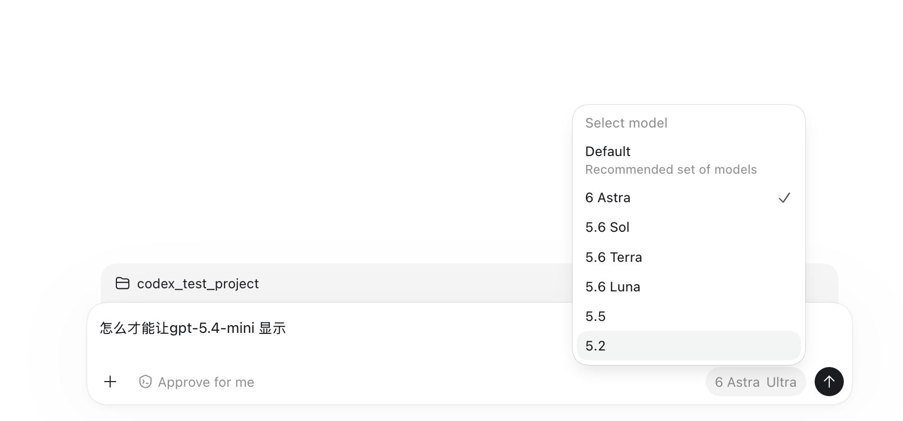

# Codex Desktop 系列02：gpt-5.4-mini 与三条暗线——全局配置菜单、退休元数据与自动审批调用链

> 系列导航：[系列01：接入 Azure GPT-6](Codex%20Desktop系列01：接入Azure%20OpenAI%20GPT-6——bundled%20CLI版本锁定、model%20catalog%20schema与分层排错.md) ｜ 本篇 ｜ [系列03：bundled 与三版本号](Codex%20Desktop系列03：bundled的真正含义与三版本号——Apple%20Bundle概念、同源不同发行版与com.openai.codex血缘.md) ｜ [系列04：Computer Use 藏身之处](Codex%20Desktop系列04：Computer%20Use藏身之处——openai-bundled%20plugin、SkyComputerUse%20native%20helper与分发链.md) ｜ [系列05：模型条目装下整个 harness](Codex%20Desktop系列05：一个模型条目装下整个harness——从gpt-6-astra展开配置看Model与Harness的真实边界.md)

> 素材来源：2026-09-05 下午的第二轮排查，由 Codex 自己执行（bundled CLI 版本核对 + `app.asar` 界面代码与内嵌 catalog 的只读分析），经 `inbox/codex` 交接。**最终状态：全链路已验收**——mini 菜单可见、切换可用、Azure 请求成功、自动审批链路恢复。但过程值得完整记录：三条暗线每一条都是第一方 harness 接第三方 provider 时的通用陷阱。

## 引言：visibility 已经是 list，为什么还看不见

[[Codex Desktop系列01：接入Azure OpenAI GPT-6——bundled CLI版本锁定、model catalog schema与分层排错]] 把 GPT-6 Astra 接进 Codex Desktop 之后，自然的下一步是让同一份 Azure catalog 里的 `gpt-5.4-mini` 也显示并可用。它的条目已经是 `visibility: "list"`，但模型菜单里只有 Default / 6 Astra / 5.6 Sol / Terra / Luna / 5.5 / 5.2——mini 不在：



按系列01 的经验，schema 已经对了、模型定义齐全、visibility 也翻了，理论上不应该有问题。这轮排查暴露出三条系列01 没碰到的暗线，其中第三条（审批调用链）是最隐蔽也最有普遍意义的一条。

## 一、暗线一：模型菜单读的是全局配置，不是项目配置

系列01 的 `model_catalog_json` 写在**项目级** `.codex/config.toml` 里，GPT-6 能用是因为当时的任务在该项目内。但 Desktop 的**全局模型菜单**走的是另一条读取路径——界面代码里获取菜单配置的请求是：

```json
{"method":"config/read","params":{"includeLayers":true,"cwd":null}}
```

`cwd: null` 意味着只解析全局配置层（App 生成的 `ConfigReadParams.ts` 协议注释明确写着：传入 `cwd` 才会解析对应项目的配置层）；`model/list` 请求本身也没有项目 cwd 参数。所以**项目级 catalog 配置不足以控制全局模型菜单**，需要在全局 `~/.codex/config.toml` 顶层（任何 `[table]` 之前——系列01 的 TOML 顶层键坑再次适用）加上同一行 `model_catalog_json`。

还有一层容易误判：`model/list` 是带 `includeHidden: true` 发的，但 UI 随后还有一个可见性过滤函数，参数包括 `authMethod`、`hasConfiguredModelCatalog`、`isCustomModelProvider`、`additionalAvailableModels` 等——**`visibility: "list"` 只是必要条件，不是充分条件**。截图里 5.5 可见但用户 catalog 里 5.5 是 `hide`，反向印证了菜单并非只看某一份目录。

## 二、暗线二：catalog 的退休元数据与 Azure deployment 现实脱节

mini 条目里带着一个系列01 没注意的字段：

```json
"upgrade": {
  "model": "gpt-5.6-luna",
  "migration_markdown": "GPT-5.4 Mini is no longer available\n\nCodex now uses GPT-5.6 Luna in place of GPT-5.4 Mini. ...",
  "retirement_at": "2026-08-31T19:00:00Z"
}
```

这是 **OpenAI 第一方世界的模型生命周期信息**：mini 在 OpenAI 侧已于 8 月底退休、迁移到 Luna。但接的是 Azure——**目录里的退休/升级/隐藏元数据，与你自己 Azure 资源里的 deployment 是否可用，是两回事**。界面代码中确实存在依据退休信息自动切换模型的逻辑（受 ChatGPT 认证状态条件控制），所以第三方 provider 场景下的正确做法是把不适用的迁移信息清掉：整个 `upgrade` 对象改为 `null`，其余能力字段保留。

两个配套注意点：App 内嵌目录里的 mini 是 `visibility: "hide"`（与 GPT-6 Astra 同一模式——官方定义齐全、默认藏起）；mini 支持的推理档位最高 `xhigh`，而全局配置是 `ultra`，切换时要显式选受支持的档位，避免意外继承。

## 三、暗线三：自动审批是第二条模型调用链，也跟 provider 走

这轮最意外的发现不在配置里，而在排查过程本身：**几乎每个需要审批的动作（联网测试、写外部文件、甚至查官方文档）都被同一个 404 拦住**——

```text
Automatic approval review failed: unexpected status 404 Not Found:
The API deployment for this resource does not exist.
url: https://open-ai-hu-demo-sweden-central.openai.azure.com/openai/v1/responses
```

关键在于：这个 404 **不是主模型请求返回的，而是审批链路返回的**。界面上的 `Approve for me`（`approvals_reviewer: auto_review`）意味着由一个**审批模型**评估每个敏感操作——而这条链路的请求同样打到你配置的 Azure provider 上。对 bundled binary 的只读分析找到了直接证据：`ConfiguredModelProvider::approval_review_preferred_model` 会根据认证状态在内置名称 `codex-auto-review` 和 `gpt-5.6-luna` 之间选择默认审批模型。这些名字在用户的 Azure 资源里没有同名 deployment——于是审批请求永远 404，主模型明明工作正常，所有需要审批的操作却全部瘫痪。

### 修复：auto_review_model_override 指向真实存在的 deployment

catalog 条目级有一个对应的覆盖字段：`auto_review_model_override`（默认 `null` 时回退到上述内置逻辑）。修复方法是把**模型条目**里的这个字段显式指到一个确实存在的 Azure deployment——主模型 Astra 和 mini 的条目都指向 `gpt-6-astra`（审批模型不必与主模型相同，用一个稳定的强模型统一承担审批即可）：

```json
{
  "slug": "gpt-5.4-mini",
  "auto_review_model_override": "gpt-6-astra"
}
```

### 验证：三种权限模式对应三种运行态

验证的严谨性值得单独记：切到 Full access（`approval_policy: never`）后写文件成功**不能**作为证据——那条路径根本不经过审批模型。三种权限模式对应三种不同的运行态，只有最后一种才真正测到审批链路：

| 界面选项 | 实际运行态 | 能验证什么 |
|---|---|---|
| Full access | `approval_policy: never` + `approvals_reviewer: user` | 直接执行，不调用审批模型 |
| Ask for approval | `on-request` + `approvals_reviewer: user` | 人工点批准，也不调用审批模型 |
| Approve for me | `on-request` + `approvals_reviewer: auto_review` | **这才是自动审批路径** |

在确认运行记录为 `auto_review` 之后，一次需要提权（`require_escalated`）的外部文件写入**通过自动审批、执行成功、读回校验通过，原来的 404 没有复现**（2026-09-05 16:04，会话 rollout 与 App 日志两处独立佐证运行态）。证据边界：没有抓到审批请求的 HTTP payload，所以严格说是"配置意图 + 404 消失"，不是抓包确认；结论限定于 Desktop `26.901.31953` / bundled CLI `0.153.1` 这个组合。

### 环境细节：GUI 进程的 key 注入

一个配套坑：GUI 进程不读 shell profile，重启 Codex App 前用 `launchctl setenv AZURE_OPENAI_API_KEY "..."` 设置用户级环境变量，新会话的审批与模型请求才能继承到 Azure key。

## 四、验证纪律：五种不同的"成功"

这轮排查最值得沉淀的方法论是把验证结果拆成五层，逐层确认而不合并宣称：

```text
配置文件已修改 → 运行进程已加载 → 模型在菜单可选 → Azure 请求成功 → 工具审批成功
```

每层都有独立的确认手段（文件读回 ≠ `config/read` 运行时对照；`codex debug models --bundled` 只输出内置目录、**忽略自定义目录**，不能用来验证自定义 catalog 是否被加载）。最终验收清单——**全部通过**：

- [x] 项目与全局 `requires_openai_auth = false` 统一；全局 `model_catalog_json` 写入
- [x] mini 的 `upgrade: null` 清理并经运行时模型列表核查
- [x] 重启后新任务中 mini 可选、不被自动迁移到 Luna
- [x] Azure 侧存在与 slug 同名的 mini deployment；实际切换 mini 用于对话成功
- [x] `auto_review_model_override` 指向 `gpt-6-astra`，真实 `auto_review` 提权操作通过、404 未复现
- [x] `launchctl setenv` 注入 Azure key + 重启 App，GUI 进程环境就绪

顺带一个活例：这轮实测同机存在 bundled `0.153.1` 与 Homebrew `0.153.4`——正是 [[Codex Desktop系列03：bundled的真正含义与三版本号——Apple Bundle概念、同源不同发行版与com.openai.codex血缘]] 里"同源不同发行版"的实证。

## 五、汇入主线：断供的第三层——治理层

把暗线三放进断供层级的框架里（见 [[Computer Use与Browser Use系列七：Web Search与浏览器操作的分界——信息获取三级梯、执行位置与成本转移]] 3.3 节）：

- **工具层**：web_search 声明不发（harness 检测到自定义 provider 后不给模型暴露工具）
- **目录层**：catalog schema 版本锁定（系列01）
- **治理层**（本篇新增）：harness 里所有**隐藏的模型调用**——审批、review、总结等——都跟 provider 走，任何一个内置模型名在你的端点上不存在，链路就会在意想不到的地方断掉

治理层断供最阴险的地方在于错误归因困难：主模型工作正常，404 却出现在审批环节，报错既不说明是哪个模型发起的请求，也不提示这是审批链路而非主链路。**接第三方 provider 时，要盘点的不只是主模型，而是 harness 会发起的全部模型调用。**

## 小结

1. **模型菜单读全局配置（`cwd: null`），项目级 catalog 配置控制不了它**；`visibility: "list"` 之后 UI 还有一层过滤——必要不充分。
2. **catalog 的退休/升级元数据是 OpenAI 第一方生命周期，不代表你的 Azure deployment 状态**：第三方 provider 场景把不适用的 `upgrade` 清为 `null`。
3. **审批链路是第二条模型调用链**：`Approve for me` 的审批模型默认取内置名称（`codex-auto-review` / `gpt-5.6-luna`），在 Azure 上无同名 deployment 就会用 404 瘫痪一切需审批操作；修复已实测有效——条目级 `auto_review_model_override` 指向已存在的 deployment。
4. **三种权限模式三种运行态**：Full access 和 Ask for approval 都不走审批模型，只有 Approve for me（`approvals_reviewer: auto_review`）才能验证审批链路。
5. **验证纪律**：文件已改 ≠ 进程已加载 ≠ 菜单可选 ≠ 请求成功 ≠ 审批成功，五层分开验收；本案例最终五层全部通过，mini 菜单可见、切换可用、审批恢复。

## 参考

- 素材：同日 Codex 会话的排查记录（bundled CLI 版本核对、`app.asar` 界面代码与内嵌 catalog 分析、审批链路 404 证据与闭环验证），经 `inbox/codex` 交接
- [openai/codex 仓库](https://github.com/openai/codex)
- 相关笔记：[[Codex Desktop系列01：接入Azure OpenAI GPT-6——bundled CLI版本锁定、model catalog schema与分层排错]]｜[[Codex Desktop系列03：bundled的真正含义与三版本号——Apple Bundle概念、同源不同发行版与com.openai.codex血缘]]｜[[Computer Use与Browser Use系列七：Web Search与浏览器操作的分界——信息获取三级梯、执行位置与成本转移]]｜[[Agent=Model+Harness——从VS Code Copilot博客看第一方绑定与多模型适配的路线之争]]
