# Codex Desktop 系列05：一个模型条目装下整个 harness——从 gpt-6-astra 展开配置看 Model 与 Harness 的真实边界

> 系列导航：[系列01：接入 Azure GPT-6](Codex%20Desktop系列01：接入Azure%20OpenAI%20GPT-6——bundled%20CLI版本锁定、model%20catalog%20schema与分层排错.md) ｜ [系列02：mini 与三条暗线](Codex%20Desktop系列02：gpt-5.4-mini与三条暗线——全局配置菜单、退休元数据与自动审批调用链.md) ｜ [系列03：bundled 与三版本号](Codex%20Desktop系列03：bundled的真正含义与三版本号——Apple%20Bundle概念、同源不同发行版与com.openai.codex血缘.md) ｜ [系列04：Computer Use 藏身之处](Codex%20Desktop系列04：Computer%20Use藏身之处——openai-bundled%20plugin、SkyComputerUse%20native%20helper与分发链.md) ｜ 本篇

> 素材：`rust-v0.153.1` 官方 catalog 中 `gpt-6-astra` 条目的完整展开（本机 Azure catalog 快照，已含系列01/02 的修改：`visibility: "list"`、`upgrade: null`、`auto_review_model_override: "gpt-6-astra"`）。

## 引言：回头看那份 JSON，它根本不是"模型元数据"

系列01 到系列04 一路碰到的几个关键字段——审批模型的 `auto_review_model_override`、退休迁移的 `upgrade`/`retirement_at`、工具形态的 `shell_type`——其实都来自同一个地方：catalog 里那**一个模型条目**。当时是排错需要，每次只看一两个字段。这次把 `gpt-6-astra` 的条目完整展开读一遍，发现一件值得单独成文的事：

**这个"模型条目"里，真正描述模型的字段只占一小截；其余的全部是 harness 行为定义**——完整的系统提示词、审批与安全政策、多 agent 编排的角色 prompt、上下文窗口管理机制、甚至商业计划矩阵。按 [[Agent=Model+Harness——从VS Code Copilot博客看第一方绑定与多模型适配的路线之争]] 的框架来读，这份 JSON 给出了一个此前没有的观察角度：**Codex 的 harness 不是一个固定的壳，而是按模型条目逐个实例化的**。



## 一、九层解剖：一个条目里各层住着谁

把条目的全部字段按职责归类，能分出九层。逐层过一遍，Model 与 Harness 的边界自己会浮现。

### ① 模型能力层——唯一真正属于 Model 的部分

```json
"context_window": 272000,
"max_context_window": 872000,
"input_modalities": ["text", "image"],
"supports_parallel_tool_calls": true,
"supported_reasoning_levels": ["low", "medium", "high", "xhigh", "max", "ultra"]
```

这些是模型训练出来的客观能力边界。值得停一下的是 reasoning levels 的最高档：

> `"effort": "ultra"` — "Maximum reasoning with automatic task delegation"

**推理档位直接挂钩多 agent 委派**——选 ultra 不只是"想得更深"，而是允许模型自动把任务拆给子 agent。模型能力层的最后一格，已经踩进了编排层的地界。

### ② 协议传输层

`prefer_websockets`、`use_responses_lite`、`supported_in_api`、`comp_hash`。系列01 的分层排错原则里"API 兼容层"对应的就是这几个字段——它们决定请求以什么形态发出，跟第三方端点组合时是潜在断点（#31882 的 400 来源）。

### ③ 工具形态层——model-harness co-design 的直接证据

```json
"shell_type": "unified_exec",
"tool_mode": "code_mode_only",
"apply_patch_tool_type": "freeform",
"web_search_tool_type": "text_and_image",
"node_repl_disabled": false
```

关键在于这些字段**按模型不同**：gpt-6-astra 用 `unified_exec`，而系列02 里看到 mini 用的是 `shell_command`；patch 工具、web search 工具的类型也逐模型指定。这不是随意的配置自由度——**工具协议跟着模型的训练分布走**：模型在什么工具形态上训练/强化过，harness 就给它发什么形态的工具。这是 [[model-harness-codesign]] 最具体的一组证据：工具不是 harness 单方面提供的，是模型与 harness 在训练时就咬合好的接口。

### ④ 系统提示词层——人格与规则是模型条目的字段

`model_messages.instructions_template` 里存的是**完整的 Codex 系统提示词**，数千词，随模型条目走。这解释了系列01 最后一道 schema 报错为什么是"缺 `base_instructions` 或 `model_messages.instructions_template`"——没有系统提示词的模型条目在 Codex 里是不完整的行为定义，加载器直接拒绝。

内容本身也值得读，几个有代表性的段落：

- **许可哲学**："You MUST complete the work that is already authorized... so that user approval is the final step"——先把活干完做成可审阅的具体结果，再让用户批准；"The user gets very frustrated when you stop and ask for confirmation"这样的用户情绪描述直接写进了提示词。
- **自主性**："bias towards action"、"Do not stop at acknowledging capability... Do not settle for a partial solution"——把"能做"当"去做"。
- **写作风格**：明令禁止 AI 腔——"Avoid using AI slop words or phrases like... 'delve,' 'foster,' 'leverage,' 'it's worth noting'"，禁止 "X, not Y" 的对比句式，禁止小结句"In short:..."。OpenAI 在系统提示词层面对抗自己模型的语言习惯。
- **双通道协议**：`commentary`（过程更新，60 秒内必须有动静）与 `final`（自包含的最终答复）分离。

**换一个模型条目 = 换一套人格、写作规则和工作方式**。系统提示词在 Codex 里不是 harness 全局资产，是 per-model 资产。

### ⑤ 治理层——系列02 三条暗线的老家

系列02 排查的审批 404，根源全在这一层的字段里：

```json
"approvals": { "on_request_auto_review": "..." },
"auto_review": { "rejection_instructions": "...", ... },
"auto_review_model_override": "gpt-6-astra",
"node_repl_auto_review_required": true,
"requires_sandboxed_review": false
```

但展开后发现治理层比系列02 看到的还厚，是一个**四件套**：

1. **auto_review**：审批模型机制本体（override、拒绝后指令——"Do not bypass this rejection through a workaround"）；
2. **guardian_v2**：一个完整的**安全分类器 prompt**——用 authorization（explicit/high/medium/low/unknown）× risk（critical/high/medium/low）双维度矩阵评估当前及前后动作，单 token 输出 `high`/`low` 决定是否进入 blocking review，还预留了 `{{ tenant_policy_config }}` 的企业策略注入位；
3. **confirmation_policies**：computer use / browser use 的**四级确认政策全文**——Hand-off required（改密码、过安全警告、金融交易必须用户亲手做）→ Confirmation at action time（CAPTCHA、永久删除、签法律协议）→ Pre-approval allowed（登录、上传、常规交易）→ Not required（只读、点赞、cookie banner）；
4. **collaboration_modes**：Default/Plan 模式的行为切换指令。

**审批模型、安全分类器、确认政策、协作模式，全部是模型条目的字段。** 这也把系列02 "治理层断供"的机理讲透了：这一层每个环节都可能发起模型调用或依赖模型名，接第三方 provider 时每个字段都是潜在断点。

### ⑥ 多 Agent 编排层

```json
"multi_agent_version": "v2",
"multi_agent_reasoning_effort": "xhigh",
"multi_agent": { "role": { "root": "You are `/root`...", "subagent": "You are an agent in a team..." } }
```

root 与 subagent 的角色 prompt（`spawn_agent` / `followup_task` / `send_message` 协议、`/root/...` 的层级命名、"All agents in the team are equally intelligent"）都在条目里；`multi_agent_reasoning_effort: "xhigh"` 甚至指定了子 agent 的推理档位。结合 ①：ultra 档触发委派、编排协议按模型版本化（v2）——**多 agent 能力也是模型与 harness 逐字段咬合的**。

### ⑦ 上下文管理层

`truncation_policy`（tokens/10000）、`auto_compact_token_limit`，以及 `token_budget` 下完整的一套机制 prompt：context window 将尽时的 reminder 模板（"save concise progress notes with the `notes` tool... call `functions.new_context`"）、notes/history 工具的使用指南、窗口切换后的恢复流程。**Codex 的"压缩续命"机制不是黑盒，全部提示词就存在模型条目里**——而且逐模型可调。对照 Claude Code 的 compaction：机制同构，但 Codex 把它做成了 catalog 数据。

### ⑧ 持久模式层

`persistent_instructions`——persistent mode 的完整行为规范：用 `send_user_message_async` 边干边汇报、`clock.sleep` 等待外部事件、`update_up_next` 记录接下来要干什么、"A pending, running, inconclusive result is not by itself completion"。这是 ChatGPT Work"持续干活"形态的 prompt 基础，也在模型条目里（甚至带着一个 `The task deadline is 2027-12-31` 的硬期限）。

### ⑨ 商业分发层

`available_in_plans`（从 free 到 enterprise 共 22 个 plan 的可用矩阵）、`service_tiers`（priority tier "Fast"，1.5x 速度）、`visibility` / `priority` / `minimal_client_version` / `upgrade`——系列02 的退休元数据住在这一层。**商业策略也编译进了同一个条目**：谁能用、多快、显不显示、何时退休。

## 二、框架推论：harness 是按模型实例化的

把九层放回 Agent = Model + Harness 的框架里，能得出几条超出单纯排错的判断：

**1. Model 与 Harness 的边界不是一条线，是一张按模型索引的表。** 讨论"harness 提供什么"在 Codex 里没有全局答案——系统提示词、工具形态、治理政策、编排协议、上下文机制都随模型条目变。同一个 Codex binary 加载不同条目，得到的是行为不同的 agent。与 Claude Code 对比很鲜明：Claude Code 的系统提示词、权限模式、hooks 是 harness 全局资产，模型只是可替换的 `model` 参数；Codex 把几乎所有 harness 行为下沉为 per-model 数据。**一个是"一套 harness 配多个模型"，一个是"每个模型自带一套 harness 切片"**——第一方绑定路线走到深处的自然形态。

**2. schema 版本锁定的严格性有了根本解释（回收系列01）。** 条目不是描述性元数据，是**行为定义**：缺一个字段不是"少了条信息"，而是"这个 agent 的某层行为未定义"。serde 拒绝加载不完整条目，本质是拒绝启动一个行为未定义的 agent。schema 随版本演进，因为 harness 行为本身在随版本演进。

**3. 治理断供的面比系列02 看到的更宽（回收系列02）。** 系列02 定位了审批模型这一个断点；展开条目后可见治理层是四件套，guardian 分类器、确认政策同样可能在特定形态下发起模型调用或依赖环境。接第三方 provider 的完整检查清单应该是：**逐层过一遍这九层，问每一层"它需要什么模型/端点/环境，我的组合里有没有"**。

**4. co-design 的证据从"论断"变成了"字段"。** [[model-harness-codesign]] 此前的证据多来自产品行为观察；这份条目给出了字段级证据：`shell_type` 按模型选、ultra 档绑定委派、`multi_agent_reasoning_effort` 指定子 agent 档位、写作风格逐模型定制。模型与 harness 不是组装关系，是接口逐个咬合的共生关系——这也回答了"为什么第三方模型接进第一方 harness 总是差口气"：**接上的只是推理端点，接不上的是这九层里剩下的八层**。

## 小结

1. **"模型条目"实为 harness 的按模型切片**：九层解剖里只有能力层真正属于 Model，系统提示词、工具形态、治理四件套、编排协议、上下文机制、持久模式、商业矩阵全是 harness 行为，全部随条目分发。
2. **Codex 的 harness 是 per-model 实例化的**，与 Claude Code"全局 harness + 可换模型"是两种架构哲学；这是第一方绑定在数据结构层的形态。
3. **schema 严格校验 = 拒绝启动行为未定义的 agent**——系列01 版本锁定的根本原因。
4. **接第三方 provider 的完整功课是逐层核对九层**，而不只是主模型调用——系列02 的治理层断供只是其中一层的一个字段。
5. **co-design 有了字段级证据**：工具协议、推理档位、编排能力在条目里逐个与模型咬合，可回填 [[model-harness-codesign]]。

## 参考

- 素材：`rust-v0.153.1` catalog 中 `gpt-6-astra` 条目完整展开（本机 Azure catalog 快照，含系列01/02 修改）
- [Codex rust-v0.153.1 官方 models.json](https://raw.githubusercontent.com/openai/codex/rust-v0.153.1/codex-rs/models-manager/models.json)
- [openai/codex 仓库](https://github.com/openai/codex)
- 相关笔记：[[Codex Desktop系列01：接入Azure OpenAI GPT-6——bundled CLI版本锁定、model catalog schema与分层排错]]｜[[Codex Desktop系列02：gpt-5.4-mini与三条暗线——全局配置菜单、退休元数据与自动审批调用链]]｜[[Agent=Model+Harness——从VS Code Copilot博客看第一方绑定与多模型适配的路线之争]]｜wiki 概念：[[model-harness-codesign]]
