# Codex Desktop 系列07：用 Jev 做 Auto 模型与推理强度路由——七模型与 effort 的判断设计、与规则匹配和轻量 LLM 路由的区别、性能准确缓存的平衡

> 前六篇拆的是 Codex Desktop 的模型目录、bundled CLI、Computer Use 与 ModelInfo 字段。本篇在模型菜单里加一个自己的 **Auto / Jev**，让 [TypeSafe 的 Jev](../../../product/TypeSafe-Jev：System-One模型、RLCD与校准决策——从聊天模型到软件可直接消费的决策原语.md) 根据任务上下文选模型和推理强度。它与 [CodexSaver](../CodexSaver深度解析——基于MCP的模型路由Token成本优化.md) 是两条路：CodexSaver 由 agent 主动把子任务派给廉价模型，这里在 provider 层做透明路由，Codex 本身不知道后面换了谁。
>
> 数据与代码来自 2026-09-27 三段 Codex 会话与项目文档。阈值与兜底表是策略参数不是校准结果；价格字段为空，全文不报告节省金额。

---

## 一、分工与粒度

三件事分给三个角色：

| 角色 | 负责 | 不负责 |
|---|---|---|
| Jev | 一次 typed 判断：选哪个 (模型, effort) 组合，任务需求是哪一档，风险有多高，当前模型有没有能力缺口 | 回答、调工具、授权；不看图片、不看完整工具输出与代码库 |
| 确定性代码（本机网关） | 置信阈值、部署与 effort 兼容性、保持时间、冷却、缓存成本门槛、兜底、绑定持久化、转发 | 不总结或重写执行模型的输入、工具定义与 prompt_cache_key |
| 执行模型 | 回答与工具调用 | 七个 Azure 部署之一 |

路由粒度是任务，不是 input。Codex 请求自带 `thread_id`、`turn_id`、`context_window_id`，网关以 thread 为绑定范围，用 turn_id 阻止同一回合内重复判断。一个任务可以跨多个 turn，绑定在任务开始时建立，只有明确事件（新任务、要求重评、能力缺口）才让 Jev 再判一次。原因见第五节的缓存账。

## 二、Jev 怎么判断：输入、问题、输出

**给 Jev 什么**

| 输入 | 内容 | 边界 |
|---|---|---|
| 最新请求 | 用户这一条输入，单独字段提供 | 明确告知"常驻仓库说明不是当前任务" |
| 近期上下文 | 最近的用户与助手文字，上限 12,000 字符 | 不含图片、工具输出、代码库；文本发往 TypeSafe |
| 候选组合 | 七个已启用模型 × 四档自动 effort 的合法交集，当前 28 个组合，每个附模型定位与 effort 参考准则 | 部署缺失或 effort 不支持的组合在送入前就排除 |
| 已知价格 | 每百万 token 的输入、缓存输入、缓存写入、输出 | 当前全部为 null，如实传 null 而不是猜 |

**问 Jev 什么**。同一次请求里四个独立问题，互相不可见：

| 问题 | 原语 | 选项或标度 | 用途 |
|---|---|---|---|
| execution | Choice | 28 个 `模型|effort` 组合 + uncertain | 主判断 |
| 任务需求 | Choice | simple / standard / demanding / unknown | 型号不确定时的分层兜底依据 |
| 高风险 | Noul | 0~1 概率 | 只影响选模，不授予执行权限 |
| 能力缺口 | Noul | 0~1 概率 | 已有绑定时是否值得升级的证据 |

把任务需求与型号选择拆成两个问题，是这套设计里最重要的一步。早期版本只问"选哪个模型"，Jev 返回 uncertain 时代码直接用最强模型兜底，一句问候也会落到 Astra。拆开后，"选不准型号"与"任务很难"是两件事：前者按需求分层兜底，后者才需要最强模型。

**Jev 返回什么**。每个 Choice 带完整概率分布与一个 confidence，例如 `execution` 返回 `choice: "gpt-6-sol|medium", confidence: 0.83, probabilities: {...}`。confidence 是分类的确定程度，不是选中模型的完成率。

**七个候选与分档**。分档是路由策略，不是本项目实测的性能排行：

| 系列 | 模型 | 路由参考定位 |
|---|---|---|
| GPT-6 | Astra | 最复杂的多步推理；复杂或高风险兜底 |
| GPT-6 | Sol | 日常及复杂编码、Agent 工作流 |
| GPT-6 | Luna | 清晰、聚焦、重复性高的任务 |
| GPT-5.6 | Sol | 旧代旗舰，复杂编码 |
| GPT-5.6 | Terra | 平衡能力与成本 |
| GPT-5.6 | Luna | 成本敏感任务 |
| GPT-5.5 | gpt-5.5 | 部署后补充验证并启用 |

## 三、确定性代码怎么把判断变成绑定

| Jev 返回 | 附加条件 | 决策 |
|---|---|---|
| 组合可信（confidence ≥ 0.7） | 不违背明确复杂或高风险信号 | 接受 Jev 选的 (模型, effort) |
| uncertain | 任务明确 simple 且风险 ≤ 0.2 | gpt-6-luna + low |
| uncertain | standard 或 unknown | gpt-6-sol + medium |
| 任一 | 明确 demanding 或风险 ≥ 0.7，且候选不足 | gpt-6-astra + high |
| 超时或非法响应 | 首次请求 | gpt-6-sol + medium，标记 provisional，不重试 |
| 超时或需求仍未知 | 已有绑定 | 保留当前组合 |
| 要求换模型 | 同任务需能力缺口证据；降档需新任务、冷却 120 s、价格与预测齐全 | 通过才切换，否则保留 |
| 切换被拒绝 | 无 | 不把被拒候选的 effort 拼到当前模型 |

三条与 effort 有关的规则：请求里的 `reasoning.effort: low` 没有来源标记，分不清是用户手选还是客户端默认，所以靠显式策略头 `X-Jev-Effort-Policy: auto|fixed` 传意图，fixed 保留请求值，auto 才允许 Jev 一并决定，头部出站前剥离；`max / ultra` 不进自动池，手动选具体模型时透传；只改 effort 也刷新组合的保持时间，否则 300 秒保持期会被绕过。

## 四、与规则匹配的区别

规则匹配指关键词、正则、长度阈值、文件类型这类确定性判断。

| 维度 | 规则匹配 | Jev |
|---|---|---|
| 读得懂上下文吗 | 不能。"继续"、"补个测试"看不出是在改格式还是查并发 | 能。近期对话进入判断，短输入靠上下文归类 |
| 候选空间 | 写死在规则里，加模型要改代码 | 运行时声明，加一个组合是加一行配置 |
| 输出 | 一个命中结果，没有把握程度 | 完整分布加 confidence，可以设门槛与兜底 |
| 延迟与费用 | 零 | 一次往返，实测同类判断在 0.2~0.5 秒；输入每百万 token 0.042 美元，输出免费 |
| 可审计 | 完全可解释 | 有概率与置信度，无理由文本 |
| 出错方式 | 规则漏写就误判且不知道 | 低置信度时会说"不确定"，由代码接管 |

结论不是二选一。硬约束留给规则：用户手选优先、部署是否存在、effort 是否被支持、不透明历史不迁移。语义判断交给 Jev。规则做筛子，Jev 在筛后的合法候选里选。

## 五、与配一个轻量 LLM 做路由器的区别

另一条常见做法是用 Luna 这类小模型读上下文，输出一个模型名。

| 维度 | 轻量 LLM 路由器 | Jev |
|---|---|---|
| 输出形态 | 生成文本或 JSON，要解析与校验；可能输出不在候选里的名字 | 封闭选项上的分布，构造上不会越界 |
| 置信度 | 可以让它写一个数，但 RLHF 训练的模型没有被训练成让这个数与正确率对应 | confidence 与 probabilities 是训练目标之一（RLCD），可以拿来设阈值，但仍需在自己的任务上校准 |
| 延迟 | 自回归生成，通常秒级；受控对照里同类单步判断 Astra 为 2~3 秒 | 单次前向，0.2~0.5 秒 |
| 费用 | 按输入输出 token 计费 | 输入极低，输出免费 |
| 能否解释 | 能给理由，便于调试 | 不给理由，只给概率 |
| 能否推理 | 可以思维链，处理模糊长任务描述更稳 | 一次前向，复杂推理不是它的位置 |
| 供应商与数据 | 与执行模型同一 Azure 资源，数据不出租户 | 近期文字发往 TypeSafe，需要评估数据边界 |
| 偏向 | 同家族模型给自家排序可能有偏 | 第三方判别器 |

两者也可以叠：Jev 做每次任务开始的快速判断，仅在它返回 uncertain 且任务被判为 demanding 时，才值得让一个 LLM 读更长上下文做二次判断。当前实现没有做这一层。

## 六、整体收益与平衡

路由的收益不是"选到便宜模型"，而是在四个量之间找到一个可运行的平衡点。

| 量 | Jev 路由带来什么 | 代价或未验证处 | 平衡手段 |
|---|---|---|---|
| 性能 | 判断本身亚秒级；任务级绑定使一个任务通常只判一次，同回合工具循环不再调 Jev | 首次判断仍加一次往返；分类质量与真实延迟未在代表性任务集上校准 | 绑定 + sticky，把判断次数从每请求降到每任务 |
| 准确率 | 拆开任务需求与型号选择后，不确定不再等于最强兜底；低置信度有明确兜底路径 | 阈值 0.7 / 0.7 / 0.2 是策略值；provisional 兜底可纠正但不自动 | 阈值可配；兜底分三档；旧绑定不自动迁移 |
| 缓存命中 | 保持模型与原始上下文使同模型前缀可复用；实测同回合第二次请求读取 15,995 与约 17,400 个缓存 token | 缓存不跨模型共享；切换后新模型冷启动；缺失字段不等于 miss 也不等于 hit | 最小保持 300 秒、冷却 120 秒、切换要过成本门槛 |
| 费用 | Jev 调用几乎不计成本；降档只在有证据时发生 | Azure 实际费率为空，禁止纯成本降档，因此不能报告节省 | 价格与预测齐全后再开成本降档 |

缓存账的算例说明为什么切换要算总账：

| 项目 | 留在模型 A | 切到模型 B |
|---|---|---|
| 历史 10 万 token 的读取价 | A 缓存价为普通价 10%，等价 1 万 token | B 无缓存，普通价为 A 的 20%，等价 2 万 token |
| 结论 | B 单价便宜五倍，这一次历史读取仍贵一倍；后续用量大或输出便宜时账又可能反过来 |

所以升降级不对称：升级看能力缺口、关键验证反复失败、任务范围扩大；降级等任务结束或明确新任务，且价格与预测齐全。Jev 回答的不是"这条消息属于哪一档"，而是"当前情况是否值得打破绑定"。

## 七、已实测与未验证

| 类别 | 内容 |
|---|---|
| 已实测 | 真实链路：Jev 首选 gpt-5.6-terra，下一回合保持，手动 Astra 直通；同回合两次请求只调一次 Jev；七模型工具矩阵全部通过（逐个指定后端，不是 Jev 一次选中七个）；CLI `-m auto-jev` 走正式配置，评估七候选并按策略回退；Desktop 菜单可见，选择后回退的原因是项目级 config 固定了模型覆盖全局，已移除 |
| 已实现未启用 | 任务分层兜底与 provisional、(模型, effort) 联合选择与 auto/fixed 策略头，离线 62 项测试通过；归档时共享服务仍是旧版本，不能声称在线 |
| 待校准或未做 | 阈值与三档兜底的分类质量与真实延迟；Azure 实际费率；28 个组合的质量与费用对比；Desktop 的 Auto effort 控件；修复后菜单选中保持的真实点击 |

放回 [FinOps 系列 01](../../FinOps/FinOps系列01：从token价格到任务完成花费——指标转向与AI使用边界.md) 的坐标，这条路由链做的是把任务完成花费拆到正确的粒度：绑定按任务而不是按调用，切换算总账而不是比单价，缓存以 usage 为证而不是以配置推断。它与 [Computer Use 系列八](../../AI/computer-use/Computer%20Use与Browser%20Use系列八：Jev×Codex实践——把动作判断交给System%20One模型的受控对照、费用账与skill优先级结论.md) 里 Jev 选 UI 动作的分工同构：Jev 给 typed 判断与置信度，确定性代码守边界。

## 八、代码与使用

完整实现放在同目录的 [jev-router/](jev-router/README.md)：约 1,800 行标准库 Python，含网关、Jev 客户端、策略、联合 effort、安装与回滚脚本、62 项离线测试与配置样例，MIT 许可。README 分两部分：**怎么用**（前置条件、四条命令、安装器改动的三处文件与备份位置、日常使用与两种"回退到 Astra"的分辨方法）和**为什么这样实现**（为什么是本机网关而不是插件、为什么用 launchd 而不随 Codex 启停、为什么按任务绑定、为什么 Jev 只判断、为什么 effort 与模型进同一个 Choice、为什么价格为空禁止成本降档、为什么安装器先起服务再改配置、为什么流式转发需要 SSE 观察器）。

| 文件 | 作用 |
|---|---|
| `gateway.py` | 回环 HTTP 服务：会话标识、绑定、调 Jev、转发 Azure、流式回传、SQLite 状态 |
| `jev.py` | 构造四个 typed 问题，校验返回 |
| `policy.py` | 任务级绑定、事件识别、上下文裁剪、分层兜底、缓存成本门槛 |
| `effort.py` | 模型与 effort 的合法组合、`auto` / `fixed` 策略、联合决策 |
| `install.py` / `control.py` | 目录条目、provider 地址、LaunchAgent 与受保护回滚；状态与成本预测 |
| `tests/` | 62 项离线测试，无真实请求 |

发布前已去除本机路径与 Azure 资源名，`config.example.json` 的 `upstream_base_url` 是占位符；evidence 与 manifest 等归档文件不随代码发布。

---

**相关阅读**

- [TypeSafe Jev：System One 模型、RLCD 与校准决策](../../../product/TypeSafe-Jev：System-One模型、RLCD与校准决策——从聊天模型到软件可直接消费的决策原语.md)
- [Computer Use 与 Browser Use 系列八：Jev × Codex 实践](../../AI/computer-use/Computer%20Use与Browser%20Use系列八：Jev×Codex实践——把动作判断交给System%20One模型的受控对照、费用账与skill优先级结论.md)
- [CodexSaver 深度解析——基于 MCP 的模型路由 Token 成本优化](../CodexSaver深度解析——基于MCP的模型路由Token成本优化.md)
- [Codex Desktop 系列01：接入 Azure OpenAI GPT-6](Codex%20Desktop系列01：接入Azure%20OpenAI%20GPT-6——bundled%20CLI版本锁定、model%20catalog%20schema与分层排错.md)、[系列05：一个模型条目装下整个 harness](Codex%20Desktop系列05：一个模型条目装下整个harness——从gpt-6-astra展开配置看Model与Harness的真实边界.md)
- wiki：[模型路由](../../../wiki/concepts/model-routing.md)
- 官方文档：[Intent routing](https://docs.typesafe.ai/patterns/intent-routing)、[Confidence](https://docs.typesafe.ai/confidence)、[Codex config reference](https://developers.openai.com/codex/config-reference)、[Prompt caching](https://developers.openai.com/api/docs/guides/prompt-caching)
