# Codex Desktop 解剖：bundled 的真正含义与 Computer Use 藏身之处——ChatGPT app 壳 + bundled CLI + bundled plugins

> 素材来源：2026-09-05 与 ChatGPT 的讨论（[原始对话](https://chatgpt.com/share/6a9b8f60-340c-83ec-b92f-99f80ef6ab2e)）。上一篇 [[Codex Desktop接入Azure OpenAI GPT-6——bundled CLI版本锁定、model catalog schema与分层排错]] 里反复出现 "bundled CLI" 这个词，这一篇把它彻底吃透，并顺带解开一个老疑问：**为什么 standalone Codex CLI 没有 Computer Use，而 Codex Desktop 有——答案就藏在 bundle 里**。

## 引言：一个组合公式

先给结论。理解 Codex Desktop 的正确心智模型不是"CLI 包了个 GUI"，而是一个三元组合：

```text
Codex Desktop App
  = ChatGPT app（Desktop UI 壳）
  + bundled Codex CLI（agent 引擎）
  + bundled plugins（browser / chrome / computer-use 等 runtime payload）
```

三个部分各有自己的版本与能力边界，装在同一个 `.app` bundle 里一起分发。上一篇的 model catalog schema 要看 bundled CLI 版本、本篇的 Computer Use 只在 App 里有，都是这个公式的推论。而要真正看懂这个公式，先要看懂 `bundle` 这个词在 Apple 体系里的分量。

## 一、Bundle 不是随口的"打包"，是 Apple 的正式架构概念

macOS 语境下的 bundle（/ˈbʌndəl/）有 Apple 官方的精确定义：

> A bundle is a directory that the system presents to people as a single file.

**Bundle 本质是一个目录，Finder 把它伪装成一个文件。** `/Applications/ChatGPT.app` 在 Finder 里是一个"文件"，实际上是：

```text
ChatGPT.app/
└── Contents/
    ├── Info.plist          ← CFBundleIdentifier / CFBundleVersion 等元数据
    ├── MacOS/              ← 主可执行文件
    ├── Frameworks/         ← bundled frameworks
    ├── PlugIns/            ← macOS 系统级 plugin（注意：与 agent plugin 不是一回事）
    └── Resources/          ← bundled resources
```

由此派生的整个词族——`bundled framework`、`bundled resource`、`bundled executable`、`CFBundle*` API——都指向同一个概念：**被放进某个自包含软件组件目录里、随主体一起分发的代码或资源**。App、Framework、Plugin、App Extension 在 Apple 眼里都是 Bundle，Bundle 里还能套 Bundle——它是一个软件组件组织模型。

为什么 Windows 和开源技术栈少见这个词？不是没有对应概念，而是选择了不同抽象：Windows 的核心分发单位是 **Package**（MSIX/APPX + Manifest + Package Identity），Unix/Linux 的传统哲学是"文件系统本身就是应用组织结构"（`/usr/bin`、`/usr/lib`、`/usr/share` 分散放置），包管理生态自然长出 package/module/crate/image 这些词。粗略的心智对照：

| 维度 | macOS / Apple | Windows / 开源 |
|---|---|---|
| 核心抽象 | Bundle（自包含目录单元） | Package（分发/安装/依赖单元） |
| 典型形态 | `.app` / `.framework` / `.appex` | MSIX / deb / npm package / Docker image |
| 元数据 | `Info.plist` | Manifest |
| 组织哲学 | 应用相关的东西收进一个目录 | 按文件系统惯例分散放置 |

一句话区分：**Bundle 偏"应用内部的组织形式"，Package 偏"分发与安装单位"**。有意思的是两边在互相渗透——Windows 也有了 `.msixbundle`，而 macOS 的 App Store 分发也带 package 属性。

## 二、bundled CLI ≠ 终端里的 codex：三个版本号并存

组合公式的第一个直接推论：一台 Mac 上可能同时存在**三个互相独立的版本号**——

```text
ChatGPT / Codex Desktop
        │
        ├── App version:      26.901.x        ← Desktop UI 壳的版本
        │
        ├── bundled CLI:      codex-cli 0.153.0   ← App bundle 内携带的引擎
        │       （/Applications/ChatGPT.app/Contents/Resources/codex）
        │
        └── terminal CLI:     codex-cli 0.153.1   ← Homebrew/npm 另装的
                （/usr/local/bin/codex 等）
```

三者互不等价。Desktop 真正启动的是 bundle 内那个二进制，所以上一篇的 `model_catalog_json` schema 兼容性要看 **bundled CLI** 的版本——终端里 `codex --version` 的结果可能比它新一个 patch，照着它去拿 schema 就会错位。这也是为什么 openai/codex 的 issue 模板要求同时报告 `Codex App: 26.xxx` 和 `Bundled CLI: 0.xxx` 两个字段（如 [openai/codex#38934](https://github.com/openai/codex/issues/38934) 的案例）。

排查任何 Desktop 行为时的第一习惯：**版本问 bundle 内的二进制**——

```bash
/Applications/ChatGPT.app/Contents/Resources/codex --version
```

### 同源，但不是同一个发行版

一个自然的追问：除了版本独立，bundled CLI 和独立安装的 CLI 源码、功能是不是完全一样？答案要分两层：**源码层面基本是同一个 [openai/codex](https://github.com/openai/codex) 开源项目；运行时/发行版层面不能视为等同**。

Desktop 打包的是一个**与该 App 版本配套测试过的固定 build**——OpenAI maintainer 的公开说法是 "Desktop app contains a bundled version of the CLI that has been tested specifically with that version of the app"，让 Desktop 换用其他 CLI binary 官方明确不推荐。公开 issue 里同一台机器出现过 standalone `0.147.0` 与 bundled `0.147.0-alpha.6.5` 并存的案例——同一个源码项目、两条发行通道、两个 build。

功能上也不能说 100% 一样。CLI binary 的核心 agent 能力高度重合，但 Desktop 在 binary 之外额外提供了 App integration、bundled plugins、native helpers、Desktop IPC 这一层。把"相同程度"按层拆开：

| 层次 | 是否一样 |
|---|---|
| GitHub 源码项目 | ✅ 基本相同 |
| Codex Agent 核心逻辑 | ✅ 高度相同 |
| CLI binary / 配置 schema | ⚠️ 同一项目的不同 build，跟版本走 |
| bundled plugins / Computer Use runtime | ❌ Desktop 专属 |
| Desktop IPC / 签名 / entitlement / 进程树 | ❌ 不一样 |

有一个公开 issue 把这条边界钉死了：**同一份 computer-use plugin cache，Homebrew standalone CLI 下不可用，App-bundled CLI 可以工作**——差异出在 macOS process authentication / Apple Events 这类 App 环境层，而不是 CLI 代码本身。所以不要把 `Contents/Resources/codex` 理解成"另一个 Codex"：它就是 Codex CLI 的一个特定配套 build，被当作 dependency bundled 进 App；Desktop 的额外能力长在 build 之外的那一层。

## 三、Computer Use 藏在哪里：不在 CLI 二进制里，在 bundled plugin 里

组合公式的第二个推论回答了那个老疑问。之前在 [[Computer Use与Browser Use系列六：Codex CLI与App的能力分界——同一套Skill、两条调用链与第三方生态补位]] 里实测过"CLI 没有 Computer Use、App 有"，当时的结论是"runtime 不对等"；这次把不对等的**物理位置**找到了。

### 3.1 藏身目录（本机已验证）

公开 issue（[openai/codex#18258](https://github.com/openai/codex/issues/18258)、[openai/codex#26451](https://github.com/openai/codex/issues/26451)）给出了路径，本机实际确认存在：

```text
/Applications/ChatGPT.app/Contents/Resources/
├── codex                              ← bundled CLI
├── cua_node/
└── plugins/
    └── openai-bundled/                ← bundled plugin marketplace
        └── plugins/
            └── computer-use/
                ├── plugin.json
                ├── .mcp.json          ← 关键：MCP server 指向 native helper
                ├── skills/
                └── Codex Computer Use.app/
                    └── Contents/SharedSupport/
                        └── SkyComputerUseClient.app/
                            └── Contents/MacOS/
                                └── SkyComputerUseClient
```

`.mcp.json` 的核心内容就一件事——把 `computer-use` 这个 MCP server 的 `command` 指向 bundle 里的 native 可执行文件：

```json
{
  "mcpServers": {
    "computer-use": {
      "command": "./Codex Computer Use.app/.../SkyComputerUseClient",
      "args": ["mcp"]
    }
  }
}
```

### 3.2 完整调用链与分发链



运行时调用链：Codex Agent（bundled CLI）→ computer-use plugin → MCP → `SkyComputerUseClient`（MCP server）→ `SkyComputerUseService` → macOS Accessibility / Screen Capture / 键鼠输入 / App discovery。**Codex 自己不实现任何桌面操作，桌面交互全部由 native helper 完成**，CLI 只是通过 MCP 协议调用它。

分发链上还有一层容易忽略的机制：App bundle 里的 plugin 不是原地运行的，Codex 启动时有一套 **bundled plugin marketplace reconciliation**——把 bundle 内 payload 安装到 `~/.codex/plugins/cache/openai-bundled/computer-use/<version>/`，实际 runtime 落在 `~/.codex/computer-use/` 下（日志里能看到 `bundled_plugins_marketplace_added`、`bundled_plugin_install_skipped_missing` 这类事件）。所以"Computer Use 在哪"有两个答案：**分发态在 App bundle 里，运行态在用户目录里**。

### 3.3 一个排查小坑：两种 plugins 目录

实际翻 bundle 时很容易先撞见 `Contents/PlugIns/CodexDockTilePlugin.docktileplugin` 然后困惑"怎么只有这个"。这是 **macOS 系统级 Plugin Bundle**（Dock 图标交互用），与 Codex 的 agent plugin 完全不是一回事：

```text
Contents/PlugIns/              ← macOS 系统 plugin 机制（DockTile 等）
Contents/Resources/plugins/    ← Codex 自己的 agent plugin marketplace
```

同名不同层，找 Computer Use 要去后者。

### 3.4 三个进一步的证据

- **payload 随架构走**：[openai/codex#31160](https://github.com/openai/codex/issues/31160) 对比发现 Intel x64 构建的 App bundle 里**根本没有** computer-use plugin 和 SkyComputerUse 组件，Apple Silicon 构建才有，且 helper 是 Mach-O arm64 而非 universal binary——Computer Use 不是被 flag 关掉了，是文件根本不在包里。`codex features list` 显示 `computer_use stable true` 也不等于有 runtime：**feature flag ≠ payload**。
- **bundled CLI 可以手动"补挂"**：公开 issue 记录过 workaround——用 bundle 内 CLI 执行 `plugin marketplace add .../openai-bundled` 再 `plugin add computer-use@openai-bundled`，CLI 侧也能出现 Computer Use。这印证了能力的载体是 plugin payload 而非 App 本身；也正因如此，社区有 "first-class Computer Use support from the Codex CLI" 的 feature request。
- **权限与签名是整体**：`SkyComputerUseClient` 从 Codex.app 进程树之外启动会因 code signature / launch context 问题失败。App Bundle + native helper + 签名 + macOS TCC 权限（屏幕录制、辅助功能）+ 进程树是一个不可拆的整体——这解释了为什么 standalone CLI 和 bundled CLI 即使 `--version` 完全相同，能力也不一定相同。

## 四、修正后的心智模型

把两条链合起来，"App = CLI 的 GUI"这个旧模型可以正式作废，换成：

```text
                Codex Desktop（.app bundle = runtime distribution）
                        │
        ┌───────────────┼────────────────┐
        ↓               ↓                ↓
   Desktop UI       bundled CLI     bundled plugins
  （ChatGPT 壳）   （agent 引擎）        │
                                ┌───────┼────────────┐
                                ↓       ↓            ↓
                             browser  chrome    computer-use
                                                     │
                                                     ↓
                                        SkyComputerUseClient/Service
                                                     │
                                                     ↓
                                                  macOS
```

**App Bundle 本身就是一个 runtime distribution**：UI 壳、agent 引擎、能力 payload 三者版本独立、能力独立，只是被 Apple 的 Bundle 机制捆成一个"文件"分发。这个视角下，此前几篇文章的结论可以统一起来：

- 上一篇的 **schema 版本锁定**——锁的是三元组合里 bundled CLI 那一元的版本；
- 系列六的 **CLI 与 App 能力分界**——分界线就是 bundled plugins 这一元在不在场；
- [[Agent=Model+Harness——从VS Code Copilot博客看第一方绑定与多模型适配的路线之争]] 的路线之争——Codex 把 harness 的能力扩展做成了 bundle 内 payload，随第一方 App 分发而不随开源 CLI 分发，这是第一方绑定在**分发层**的形态（模型层、工具声明层之外的第三层）。

## 五、血缘与开源边界：ChatGPT.app 是 Codex Desktop 演化来的

组合公式里"ChatGPT app 壳"这一元还值得再追问一层：它和还在维护的 **ChatGPT Classic** 是一个东西吗？为什么它没有开源代码？

答案先说结论：**不是一个东西，且血缘方向和名字暗示的相反——新 ChatGPT.app 不是 Classic 加了个 Codex，而是 Codex Desktop 演化/扩展出来的统一 Desktop Shell**。

- **产品关系**：OpenAI 官方口径是 ChatGPT Classic = 上一代 ChatGPT 桌面客户端（继续独立维护、有自己的更新与 Enterprise 能力），新 ChatGPT.app = Chat + Work + Codex 的统一应用；原 Codex App 用户升级后直接变成 ChatGPT.app，Codex chats/projects 全部保留，且 "new agent features may be available only in the new app"。
- **血缘证据**：`codesign -dv --verbose=4 /Applications/ChatGPT.app` 可以看到，这个名叫 ChatGPT 的 app，bundle identifier 仍然是 **`com.openai.codex`**——软件工程血缘上它就是原 Codex Desktop 的延续，改名合并了 Chat/Work 形态，而不是把两个 `.app` 拼起来。
- **开源边界**：整个 bundle 里只有 Codex CLI 这一元对应开源仓库 openai/codex；ChatGPT/Work 客户端部分和 SkyComputerUse native helper 都是 proprietary，没有 `openai/chatgpt` 这样的公开 repo 可对源码。

把三个名字的关系画清楚：

```text
ChatGPT Classic        ← 上一代 proprietary ChatGPT 桌面客户端（维护型）
ChatGPT.app            ← 新一代 proprietary Desktop Shell（主线）
  ├── ChatGPT / Work        （proprietary，无公开源码）
  └── Codex
       ├── bundled Codex CLI（开源，openai/codex 的配套 build）
       └── bundled Computer Use（proprietary native runtime）
codex CLI（独立安装）   ← openai/codex 开源项目的 standalone 发行版
```

这一层也让组合公式更精确：三元组合里，**开源的只有中间那一元（CLI），且只是它的一个特定 build；壳与能力 payload 都是专有的**。所谓"Codex Desktop"在文件系统里根本没有以自己名字存在——它是 `com.openai.codex` 这个 bundle 顶着 ChatGPT 的名字活着。

## 小结

1. **Bundle 是 Apple 的软件组件组织模型**：目录伪装成文件、自包含分发；与 Windows/开源的 Package 是两种哲学——前者管"应用内部组织"，后者管"分发安装单位"。
2. **Codex Desktop = ChatGPT app 壳 + bundled CLI + bundled plugins**，三个版本号互相独立；排查 Desktop 行为一律以 `Contents/Resources/codex --version` 为准。
3. **Computer Use 是 bundled plugin + native helper，不是 CLI 功能**：分发态在 `Resources/plugins/openai-bundled/plugins/computer-use/`，运行态 reconcile 到 `~/.codex/`，桌面操作由 SkyComputerUseClient/Service 通过 MCP 提供；feature flag ≠ payload，签名/权限/进程树是整体。
4. **`Contents/PlugIns/` 与 `Contents/Resources/plugins/` 是两套机制**：前者是 macOS 系统 plugin，后者才是 Codex agent plugin marketplace。
5. **bundled CLI 与 standalone CLI 同源不同发行版**：同一个 openai/codex 项目、两条发行通道、配套测试的不同 build；能力差异出在 build 之外的 App 环境层（签名/Apple Events/进程树），同一份 plugin cache 在 standalone CLI 下就是跑不起来。
6. **ChatGPT.app 的血缘是 Codex Desktop**：bundle identifier 仍为 `com.openai.codex`，新 app 是 Codex Desktop 演化出的统一壳（Chat + Work + Codex）；三元组合里只有 CLI 一元开源，壳与 Computer Use payload 均为 proprietary。

下一步可挖的方向：把 computer-use plugin 从 `plugin.json` → `.mcp.json` → `skills/` → `SkyComputerUseClient` 完整逆向一遍，画出 Codex Computer Use 的内部架构图——与 Orca 补位方案（[[Orca使用笔记二——Computer Use桌面控制与Codex CLI补位实践]]）做同层对比。

## 参考

- [原始讨论（ChatGPT share）](https://chatgpt.com/share/6a9b8f60-340c-83ec-b92f-99f80ef6ab2e)
- [Apple Developer 文档：Bundles and packages](https://developer.apple.com/documentation/foundation/bundles_and_packages)
- [openai/codex#18258 — App bundle 内 openai-bundled/computer-use plugin 目录报告](https://github.com/openai/codex/issues/18258)
- [openai/codex#26451 — computer-use plugin 内部结构与 bundled marketplace reconciliation 日志](https://github.com/openai/codex/issues/26451)
- [openai/codex#31160 — Intel x64 与 Apple Silicon 构建的 Computer Use payload 差异](https://github.com/openai/codex/issues/31160)
- [openai/codex#38934 — App version 与 Bundled CLI version 的区分](https://github.com/openai/codex/issues/38934)
- 相关笔记：[[Codex Desktop接入Azure OpenAI GPT-6——bundled CLI版本锁定、model catalog schema与分层排错]]｜[[Computer Use与Browser Use系列六：Codex CLI与App的能力分界——同一套Skill、两条调用链与第三方生态补位]]｜[[Agent=Model+Harness——从VS Code Copilot博客看第一方绑定与多模型适配的路线之争]]｜[[Orca使用笔记二——Computer Use桌面控制与Codex CLI补位实践]]
