# OCI 镜像工具生态——分工补位与供应链全景

> Skopeo 不是孤立工具，它属于"Container Image / OCI Registry 管理"这一层的工具族。这一层与传统的 Container Runtime 是两个维度——**前者管镜像的生命周期，后者管容器的运行**。本文把这一层的五个高频工具（Skopeo、crane、regctl、ORAS、Cosign）放在一起理清各自的边界与补位关系。
>
> Skopeo 本体的定位、核心能力与实战场景，见姊妹篇：[Skopeo 实战——不装 Docker 的镜像搬运：定位、核心能力与 Mac ARM 离线分发场景](Skopeo实战——不装Docker的镜像搬运：定位、核心能力与Mac%20ARM离线分发场景.md)。



## 1. 五个工具，四类问题

| 工具 | 所属生态 | 核心问题 | 记忆法 |
|---|---|---|---|
| **Skopeo** | Red Hat / Podman ecosystem | Image 在 Registry 之间怎么搬、检查、同步 | **搬运工** |
| **crane** | Google `go-containerregistry` | 怎么用 CLI 精细操作远程 Registry/Image | **Registry 瑞士军刀** |
| **regctl** | regclient 社区 | 怎么低层级管理 Manifest/Blob/Tag | **Registry 调试工具** |
| **ORAS** | OCI 社区 | Registry 不只放 Image，还能放任意 OCI Artifact | **OCI 文件系统** |
| **Cosign** | Sigstore | 怎么签名/验证 Image 和 Artifact | **公证/盖章** |

四类问题的划分比五个工具名更重要：

```text
Skopeo → transport（搬运）
crane / regctl → registry manipulation（操作/调试）
ORAS   → artifact storage（放"不只是 Image"的东西）
Cosign → artifact identity / integrity（签名/验证）
```

## 2. crane：Google 派的远程 Image CLI

[crane（go-containerregistry）](https://github.com/google/go-containerregistry)来自 Google 的 `go-containerregistry` 项目（Go library + CLI）。与 Skopeo 能力有大量重叠，但侧重点不同——Skopeo 是"把 Image 从 A 搬到 B"，crane 是"直接操作远程 Registry 里的 Image"：

```bash
crane ls ghcr.io/myorg          # 列 repository/tag
crane digest nginx:latest       # 直接拿 digest
crane manifest nginx:latest     # 直接拿 manifest
crane tag myimage:abc123 latest # 远程直接打 tag，无需 pull→tag→push
```

`crane tag` 是 CI/CD 里的经典用法：构建产出 `image:commit-abc123` 后，直接在远程 Registry 上补一个 `latest` tag，全程不启动 Docker daemon。GitHub Actions / GitLab CI 场景中非常常见。

## 3. regctl：更底层的 Registry 调试

[regctl（regclient）](https://github.com/regclient/regclient)面向更低层级：直接查看和操作 Registry 的 Repository、Manifest、Manifest List/Index、Blob、Tag、Digest。适合回答"为什么这个镜像在 ACR 能 pull、在 Harbor 不能"、"这个 multi-arch 镜像的 manifest 究竟长什么样"这类调试问题。

## 4. ORAS：Registry 的角色升级——从镜像仓库到 Artifact 仓库

[ORAS（OCI Registry As Storage）](https://oras.land/)代表一个重要的认知升级：**OCI Registry 本质是 content-addressable storage，没理由只存 Container Image**。Helm Chart、SBOM、WASM、签名，乃至 AI 模型权重、Tokenizer、配置，都可以作为 OCI Artifact 进 Registry 统一管理：

```text
Model / Weights / Config / Tokenizer / SBOM / Signature
                    ↓
               OCI Artifact
                    ↓
            ACR / Harbor / GHCR
```

对 AI Infra / Model Serving 方向，ORAS 所代表的 "AI artifact supply chain" 比 Skopeo 本身更值得长期关注——模型分发正在向 OCI Artifact 体系收拢。

## 5. Cosign：完全不同的问题——身份与完整性

[Cosign（Sigstore）](https://github.com/sigstore/cosign)不是搬运工具，它解决"**怎么证明这个 Image 是谁发布的、且没有被篡改**"：发布方 `cosign sign` 产出签名进 Registry，部署侧（如 Kubernetes admission）`cosign verify` 通过才放行：

```text
Developer → Image → cosign sign → Signature → Registry
                                                  │
Kubernetes admission ← cosign verify ─────────────┘
        │
   valid → Deploy ／ invalid → 拒绝
```

## 6. 完整供应链：五工具在 ACR + AKS 链路上的合位

```text
GitHub → Build Image → ACR ← Skopeo（跨 Registry copy/sync）
                        ↑  ← crane / regctl（tag/digest/manifest 操作与调试）
                        ↑  ← ORAS（模型/SBOM/Chart 等 Artifact）
                        │
                     Cosign（签名 → AKS 侧验证）
                        ↓
                   AKS → GPU Node → vLLM
```

这背后是一个认知升级：从 **Container Runtime 视角**（`Image → Registry → Kubernetes`，关心怎么跑）升级到 **Supply Chain 视角**（Image、Model、SBOM、Signature 都是 OCI Artifact，关心怎么管）。从"使用 Container"进入"管理 Container/AI Artifact Supply Chain"，正是这族工具开始高频出现的信号。

## 7. 学习顺序建议

按 AI Infra + ACR + GPU 的工作方向，五个工具的优先学习顺序建议为：**Skopeo → crane → ORAS → Cosign → regctl**。其中 ORAS 与 Cosign 代表的 artifact/model supply chain，比单纯的镜像搬运更接近未来的重心；regctl 则在遇到 Registry 兼容性/manifest 疑难问题时按需上手即可。

---

## 参考

- [Skopeo GitHub Repository](https://github.com/podman-container-tools/skopeo)
- [crane（go-containerregistry）](https://github.com/google/go-containerregistry)
- [regctl（regclient）](https://github.com/regclient/regclient)
- [ORAS — OCI Registry As Storage](https://oras.land/)
- [Cosign（Sigstore）](https://github.com/sigstore/cosign)

> 本文素材来自一次 ChatGPT 咨询讨论的整理与核实（2026-09-15），仓库地址与项目状态已逐一核验。
