# Skopeo 实战——不装 Docker 的镜像搬运

> 一句话定位：**Skopeo 是专门用来"搬运、检查、同步 Container Image"的命令行工具——不需要安装 Docker，也不需要任何 daemon 在跑。** Docker 回答的问题是"我要把 Container 跑起来"，Skopeo 回答的是"我不想跑 Container，我只想操作这个 Image 本身"。
>
> 姊妹篇：Skopeo 周边的 crane、regctl、ORAS、Cosign 分工与供应链全景，见 [OCI 镜像工具生态——crane、regctl、ORAS、Cosign 的分工补位与镜像供应链全景](OCI镜像工具生态——crane、regctl、ORAS、Cosign的分工补位与镜像供应链全景.md)。

## 1. 它解决什么问题：把镜像搬运从"绕道本地"变成"Registry 直连"

传统 Docker 思路下，把一个镜像从 Registry A 搬到 Registry B，要走一条绕道本地的链路：

```bash
docker pull image        # Registry A → Docker Engine → 本地磁盘
docker tag image ...
docker push ...          # 本地磁盘 → Docker Engine → Registry B
```

整条链路是 `Registry A → Docker Engine → 本地磁盘 → Docker Engine → Registry B`，前提还包括：本机装了 Docker、daemon 正在运行、磁盘装得下整个镜像。

Skopeo 把这条链路压缩成一步直连：

```bash
skopeo copy \
  docker://docker.io/library/nginx:latest \
  docker://myregistry.azurecr.io/nginx:latest
```

镜像的 Manifest 和 Layers 直接从 Registry A 流向 Registry B，**不落本地、不经过 daemon**。官方文档明确说明，Skopeo 的大多数操作既不需要 root，也不需要任何 container daemon 在运行——这正是它作为跨平台"轻装工具"的价值：在 CI runner、跳板机、甚至一台只有二进制的裸机上都能直接干活。

## 2. 出身与定位：Red Hat 模块化容器工具的"运输层"

Skopeo 最初由 Red Hat 工程师发起，是 Apache 2.0 开源项目，现在属于 Podman Container Tools 生态（仓库：[podman-container-tools/skopeo](https://github.com/podman-container-tools/skopeo)，11k+ stars），底层使用 `containers/image` 库。

理解它的位置，最好的模型是 Red Hat 对容器工具的"模块化拆分"——Docker 用一个 CLI 打包了所有事情，而 Red Hat 生态按职责拆成三层，共享同一套底层库：

```text
                  containers/image（共享底层库）
                         │
            ┌────────────┼────────────┐
            │            │            │
         Buildah       Skopeo       Podman
            │            │            │
          造（build）  搬（transport） 跑（run）
```

- **Buildah** 解决"怎么造 Image"
- **Skopeo** 解决"怎么搬 Image"
- **Podman** 解决"怎么跑 Image"（同生态还有 CRI-O 作为 Kubernetes container runtime）

这也解释了一个常见疑问：**为什么用了多年 Docker、Kubernetes、Podman，却很少听说 Skopeo？** 原因有四：

1. **Docker 把一切打包了**——`build/pull/push/run/inspect` 一个 CLI 全包，应用开发者感知不到"运输"是独立环节；
2. **Kubernetes 不关心它**——K8s 只面向 `containerd / CRI-O` 拉镜像，从不要求用户管理镜像搬运；
3. **Podman 隐藏了它**——Podman 与 Skopeo 共享 `containers/image` 底层，用 `podman pull/push` 时实际已在使用同一套传输能力，只是没直接碰 Skopeo CLI；
4. **工作视角不同**——只要工作是"运行镜像"（build → push → deploy），Skopeo 没有存在感；一旦工作变成"管理镜像"（多 Registry、迁移、同步、air-gapped、供应链安全），它就是主力工具。

## 3. 核心能力

### 3.1 inspect：不拉取镜像，直接看远程 Registry

Docker 想看一个镜像的元数据，必须先把整个镜像 pull 下来。Skopeo 直接访问 Registry 的 Manifest：

```bash
skopeo inspect docker://docker.io/library/python:3.13
```

返回 Digest、Architecture、OS、Layers、Labels、Created 等完整元数据，**一个字节的 Layer 都不用下载**。对动辄几十 GB 的 CUDA/vLLM 镜像，这是"侦察兵"级别的效率差异。Skopeo 名字本身来自希腊语，大意是"远程查看"（remote viewing），对应的正是这个最早的核心能力。

### 3.2 copy：多种存储类型之间任意搬运

`skopeo copy` 的 source 和 destination 支持多种 image storage 类型：Docker Registry、OCI layout、本地目录、Docker archive、Docker daemon storage、containers/storage 等。几个典型用法：

```bash
# Registry → Registry 直连（最经典场景）
skopeo copy docker://docker.io/library/ubuntu:24.04 \
            docker://myacr.azurecr.io/ubuntu:24.04

# Docker 格式 → OCI 格式转换
skopeo copy docker://docker.io/library/nginx:latest oci:./nginx

# Registry → tar 包（离线带入内网后 docker load）
skopeo copy docker://docker.io/library/nginx:latest \
            docker-archive:nginx.tar:nginx:latest

# 复制完整多架构镜像（而非只复制当前系统架构）
skopeo copy --all docker://source/image:v1 docker://target/image:v1
```

`--all` 值得单独强调：现代镜像多为 OCI Image Index / Manifest List（一个 tag 下挂 `linux/amd64`、`linux/arm64` 等多个架构）。在 Apple Silicon Mac 上开发、往 amd64 GPU 服务器部署的链路里，不带 `--all` 的复制只会带走当前架构，这是镜像迁移最常见的坑之一。注意 Skopeo 只搬运**已存在**的架构变体，不做任何平台/架构转换——架构在构建时就由基础镜像和各层二进制决定了，多架构必须在构建端解决（详见 4.1 节的能力边界分析）。

### 3.3 sync 与 delete：仓库级同步与远程清理

`skopeo sync` 支持把整个 repository 在 Registry 之间同步，官方明确把 "external repository → internal registry / air-gapped deployment" 列为核心用途；`skopeo delete` 可直接删除远程 Registry 中的镜像。

### 3.4 digest：生产环境的"不可变引用"

Tag 是可变的——`vllm:latest` 今天指向 `sha256:AAA`，明天可能变成 `sha256:BBB`。生产部署、CI/CD、SBOM、Image Promotion 都应关心 `image@sha256:xxxx` 这种不可变引用。Skopeo 不用完整 pull 就能直接读取 Registry 中的 Manifest/Digest，是供应链场景里做 digest 固定与核验的基础工具。

## 4. 真实场景：Mac ARM 上不装 Docker，把测试好的镜像压缩发给客户

这是笔者选择 Skopeo 的直接原因，链路如下：



背景约束：

- **构建在 CI**：GitHub Actions 打包镜像（Linux 基础镜像，产物为 `linux/amd64`），推送到 Azure Container Registry（ACR）；
- **本地是 macOS + Apple Silicon（ARM）**：因为 Docker Desktop 占用空间太大，本地**没有安装 Docker**；
- **交付需求**：测试通过后交付给客户；客户侧**同样使用 Azure Container Registry**，双方 Registry 不互通，所以以压缩包交接，客户收到后导入自己的 ACR 再部署。

整条链路里，本地机器唯一的职责是"从 ACR 取出指定版本、打成压缩包"——这正是 Skopeo 的正业，完全不需要为此装一个几 GB 的 Docker Desktop：

```bash
# 安装：约几十 MB，无 daemon、无内核虚拟机
brew install skopeo

# 登录 ACR（也可用 az acr 的 token）
skopeo login myacr.azurecr.io

# 关键一步：从 ACR 直接导出为 docker-archive
# 注意：本机是 darwin/arm64，而镜像是 linux/amd64，
# 必须显式 override，否则 Skopeo 默认按本机平台选架构（找不到就报错）
skopeo copy \
  --override-os linux --override-arch amd64 \
  docker://myacr.azurecr.io/myapp:v1.2.0 \
  docker-archive:myapp-v1.2.0.tar:myapp:v1.2.0

# 压缩后发给客户
gzip myapp-v1.2.0.tar
```

客户侧导入自己的 ACR（同样用 Skopeo 即可，客户本地也不需要 Docker）：

```bash
gunzip myapp-v1.2.0.tar.gz
skopeo login customer.azurecr.io
skopeo copy docker-archive:myapp-v1.2.0.tar \
            docker://customer.azurecr.io/myapp:v1.2.0
```

之后客户从自己的 ACR 正常部署（AKS / Container Apps / `docker run` 均可）。

顺带说明：**压缩包这一步只在双方 Registry 不互通时才需要**。如果网络可达、且拿得到对方 ACR 的凭据，一条命令 Registry 直连、连 tar 都不用落盘：

```bash
skopeo copy --override-os linux --override-arch amd64 \
  docker://myacr.azurecr.io/myapp:v1.2.0 \
  docker://customer.azurecr.io/myapp:v1.2.0
```

（Azure 体系内也可以用 `az acr import --source` 做同样的事，本质相同——服务端 Registry 到 Registry 拉取。）

几个实践要点：

1. **架构 override 是 Mac ARM 的必修课**——`docker-archive` 格式只能装单一架构镜像（不支持 multi-arch），Skopeo 默认按当前平台（darwin/arm64）挑选架构变体；CI 产物只有 `linux/amd64` 时不指定 `--override-os linux --override-arch amd64` 就会直接报错或选错；
2. **`docker-archive:` 的第二段参数**（`:myapp:v1.2.0`）会写进 tar 的元数据，决定导入端默认看到的镜像名和 tag（客户往自己 ACR 导入时，最终名字以 `docker://` 目标地址为准），不写的话是 `<none>:<none>`；
3. **发货前先核验**——`skopeo inspect docker://myacr.azurecr.io/myapp:v1.2.0` 确认 Digest 和 Architecture，把 Digest 一并写进交付说明，客户侧可对账；
4. **归档格式的选择**：目的地是客户的 ACR（而非 Docker daemon）时，`docker-archive:` 与 `oci-archive:` 都能胜任——前者额外兼容客户临时想 `docker load` 到本机的情况，后者是 OCI 标准格式，对 skopeo/containerd/Podman 更中立（transport 类型全景见第 7 节）。

这个场景也印证了 Skopeo 的定位：**构建在 CI、存储在 Registry、运行在客户侧，本地只做"搬运"——链路上每个环节都不需要本地 Docker。**

### 4.1 为什么本地能 work：`--override` 是"挑选"，不是"转换"

一个容易产生的误解是：Mac ARM 上加了 `--override-os linux --override-arch amd64` 就能把镜像"转"成 amd64。**Skopeo 不做任何平台/架构转换**——架构是构建时就烧死在镜像里的，由基础镜像（`FROM ubuntu:24.04` 拉到的是哪个架构）和每一层里的二进制决定，搬运工具改变不了它。理解这条链路为什么能 work，要拆成三层：

**第一层：Registry 里存的是"变体列表"，Skopeo 默认按本机挑。** 一个镜像 tag 背后可能是 manifest list（multi-arch），也可能只有单一架构：

```text
myapp:v1.2.0
   ├── linux/amd64   ← CI 构建出来的（本场景只有这一个）
   └── linux/arm64   ← 只有 CI 也构建了它，它才存在
```

`skopeo copy` 拉取时默认按"本机平台"从列表里挑变体。在 darwin/arm64 的 Mac 上，它会去找 arm64 变体——而 CI 只构建了 amd64，于是找不到、报错。

**第二层：`--override-os / --override-arch` 只是改变"挑选的依据"。** 这两个参数的含义是"别按我这台机器的平台挑，按我指定的平台挑"——让 Skopeo 在挑选时假装自己是一台 linux/amd64 机器，从而挑中 CI 构建的那个**现成**变体。挑中之后原样下载、原样打包，Layer 里的二进制一个字节都不会动。如果 Registry 里根本不存在指定架构的变体，加任何参数都变不出来。

**这正是本地能 work 的原因**：本地机器只是搬运的"经手人"，它自己的 CPU 架构和镜像内容毫无关系——镜像从头到尾都是 linux/amd64，Mac 从不需要"能运行"它，只需要"能下载和打包"它。也因此，**客户机器必须是 amd64 才能跑这个包**；哪天客户要 ARM 服务器版本，要改的是 GitHub Actions 的构建矩阵（`docker buildx build --platform linux/amd64,linux/arm64`，或原生双架构 runner 分别构建再合并 manifest），而不是 Skopeo 命令。

**第三层：Skopeo 唯一会"转换"的是格式，不是平台。** `docker://` ↔ `oci:` ↔ `docker-archive:` 之间的转换只发生在打包格式/元数据 schema 层面（Docker schema ↔ OCI spec），与运行平台无关。"格式可以转、平台只能挑"——这一句可以作为 Skopeo 能力边界的总结。

顺带厘清 `--override-*` 与 `--all` 的关系：前者是"从列表里挑指定的一个变体"，后者是"整个列表全搬走"（搬运 multi-arch 镜像到另一个 Registry 时用）；而 `docker-archive:` 格式只能装单一架构，所以离线交付场景天然是"挑一个"，两者不会同时出现。

## 5. 其他典型场景

### 5.1 Air-gapped 环境：Skopeo 的经典战场

客户 GPU 集群与公网物理隔离时，`docker pull` 无从谈起。两条标准路径：

- **离线包**：有网机器上 `skopeo copy docker://ghcr.io/xxx/vllm:latest docker-archive:vllm.tar:vllm:latest`，把 tar 物理带入内网后 `docker load`（与第 4 节笔者的交付场景同构，只是隔离级别更高）；
- **分级 Registry**：`External Registry → (Skopeo copy/sync) → DMZ Registry → Internal Registry → Kubernetes → GPU Nodes`，Skopeo 作为各级之间的同步引擎。

### 5.2 企业 AI Infra：多 Registry 之间的镜像流转

AI 推理链路（如 `vLLM/CUDA 镜像 → ACR → AKS/GPU Node`）的镜像来源天然多元：Docker Hub、ghcr.io、NVIDIA NGC、企业 Harbor。跨源汇聚到 ACR、再向客户环境分发，`skopeo copy/sync` 是比 `docker pull/tag/push` 干净得多的选择——尤其在 CI runner 或跳板机这类不适合跑 Docker daemon 的位置。

## 6. 什么时候需要它

- **普通应用开发者**（`docker build/run/pull/push` 走天下）：不需要 Skopeo；
- **本地不想装 Docker、但要跟 Registry 打交道**（如第 4 节的 Mac ARM 离线交付）：Skopeo 是最轻的答案；
- **AI/Cloud Infra**（经常面对 `ACR ↔ Docker Hub ↔ Harbor ↔ NGC ↔ air-gapped`）：建议装；
- **企业级 AI Platform**（Image promotion、多 Registry、多架构、digest 管理、供应链安全、Registry 同步）：Skopeo 是基础件。

Skopeo 之外，围绕 OCI Registry 还有一族分工不同的工具（crane、regctl、ORAS、Cosign），它们与 Skopeo 如何互相补位、以及完整的镜像供应链全景，见姊妹篇：[OCI 镜像工具生态——crane、regctl、ORAS、Cosign 的分工补位与镜像供应链全景](OCI镜像工具生态——crane、regctl、ORAS、Cosign的分工补位与镜像供应链全景.md)。

## 7. 附：transport 类型全景——`docker-archive` 是什么、还有哪些

Skopeo 命令里每个镜像地址都写成 `传输类型:位置` 的形式，`docker://` 与 `docker-archive:` 只是其中两种 **transport（传输/存储类型）**。完整家族：

| Transport | 含义 | 典型用途 |
|---|---|---|
| `docker://` | 远程 Registry（Docker Registry V2 / OCI Distribution API） | ACR、Docker Hub、Harbor、gcr.io——名字带 docker，实为通用 Registry 协议 |
| `docker-archive:` | `docker save`/`docker load` 使用的 tar 格式 | 离线交付，兼容 Docker 侧导入 |
| `docker-daemon:` | 本机 Docker daemon 的内部存储 | 与本地已安装的 Docker 交换镜像 |
| `oci:` | OCI Image Layout（标准化的本地目录结构） | 落成标准格式目录，供其他 OCI 工具消费 |
| `oci-archive:` | OCI Layout 打成的 tar | 离线交付，OCI 标准格式，containerd/Podman 侧更中立 |
| `containers-storage:` | Podman/Buildah/CRI-O 的本地存储 | Red Hat 生态内部交换 |
| `dir:` | Skopeo 自有的裸目录格式（manifest + layer blob 平铺） | 调试、查看镜像内部结构，非标准格式 |

理解这张表的关键：**格式只有两个"家族"，其余都是存放位置的区别**——

- **Docker 家族（历史遗留）**：Docker 早于标准出现，自定义了 manifest schema 和 `docker save` 的 tar 结构，`docker-archive:` 属于它；
- **OCI 家族（行业标准）**：业界后来把镜像格式标准化为 OCI Image Spec（Manifest、Image Layout 均有规范），`oci:` / `oci-archive:` 对应它，containerd、Podman、Kubernetes 生态原生支持。

两个家族内容等价，`skopeo copy` 可互转（4.1 节"格式可以转、平台只能挑"即指此）。顺带澄清一个易混点：Google 没有自己的镜像格式——crane 是 Google 的**工具**（见姊妹篇），gcr.io 是 Google 的 **Registry 服务**（对 Skopeo 而言就是 `docker://gcr.io/...`）；格式层面如今就是 Docker 遗留 + OCI 标准两分天下，并持续向 OCI 收拢。

---

## 参考

- [Skopeo GitHub Repository](https://github.com/podman-container-tools/skopeo)

> 本文素材来自一次 ChatGPT 咨询讨论的整理与核实，并补充了笔者的实际交付链路（2026-09-15）；仓库地址与项目状态已核验。
