# 动态 SVG 全景——原理、元素分类、生态限制与 Lottie 等替代方案对比

给 [[OpenAI Jalapeño推理芯片——从ASIC基础到首测数据解读的AI推理硬件全景]] 配的两张动态流程图（流动光带、沿路径移动的发光粒子、当前阶段呼吸脉冲），只用了一个约 10KB 的 `.svg` 文本文件，无 JavaScript、无外部依赖，Obsidian 和 GitHub 都能直接播放动画。这引出一连串值得系统梳理的问题：SVG 动画的原理是什么？小红书上常见的动效也是 SVG 吗？这些 `<animateMotion>`、`<feGaussianBlur>` 标签是 HTML 的一部分吗？想在 PPT 里复用怎么办？和 App 动效领域的 Lottie 相比各自的边界在哪里？

本文把这些问题串成一条脉络：先讲清 SVG 是什么、动画怎么动起来，再拆解一份实际文件的元素分类，然后划出它的能力边界与生态限制，最后对比替代方案并给出场景化选型。

## 一、SVG 是什么：文本描述的矢量图

SVG（Scalable Vector Graphics）是一种 **XML 文本格式的矢量图**。它不存储像素，而是存储"画图指令"——`<circle>`、`<path d="M 133 150 H 1025...">` 这样的几何描述，由渲染引擎（通常是浏览器内核）在打开时实时计算并栅格化。这带来两个根本特性：

- **无限缩放不失真**：放大只是重新计算几何，没有像素可糊；
- **文件极小**：一张信息密度很高的流程图约 10KB，同等清晰度的 GIF 可能要几 MB。

### 与 HTML 的关系：不是 HTML 标签，但同属一个家族

`<svg>` 及其内部标签**不是 HTML 标签，而是 SVG 词汇表**——两套不同的 XML 词汇，由 W3C 分别制定规范。它们的协作关系：

- HTML5 允许把 `<svg>` 作为"外来内容（foreign content）"**直接内联嵌入** HTML 文档，浏览器解析到 `<svg>` 时切换到 SVG 解析模式；
- 单独的 `.svg` 文件是**自成一体的 XML 文档**，根元素就是 `<svg>`，不需要 HTML 包裹，浏览器可直接打开；
- **CSS 被 HTML 和 SVG 共享**：`@keyframes`、`animation` 语法两边通用，只是 SVG 有自己的可动画属性（如 `stroke-dashoffset`——HTML 元素没有"描边"这个概念）。

准确的心智模型：**浏览器是一台支持多种语言的渲染机——HTML 管文档结构，CSS 管样式和动画，SVG 管矢量图形，三者互相嵌套协作。**

### 三种动画机制

1. **SMIL**：SVG 原生动画标签，如 `<animateMotion>` 让元素沿 path 移动，`<animate>` 改任意属性——单文件自包含，不依赖外部代码；
2. **CSS 动画**：`<style>` 里的 `@keyframes` 驱动 `stroke-dashoffset`（流动光带）、`opacity`（呼吸脉冲）等属性；
3. **JavaScript**：任意复杂交互，但很多宿主环境（如 GitHub）会剥离脚本。

前两种可以打包在单个 `.svg` 文件里随处分发，第三种把动画逻辑放在了文件之外——**要保证"单文件自包含"，只用 SMIL + CSS**。

## 二、拆解一份实际文件：SVG 元素的五层分类

以 Jalapeño 交付流程图的源码为例（`asset/jalapeno-chip-pipeline-2026-08-26.svg`，可用 VS Code 以文本打开对照），全部元素按职责分五层：

### 1. 文档骨架

| 元素 | 作用 |
|---|---|
| `<svg>` | 根元素。`width/height` 定显示尺寸，`viewBox` 定内部坐标系，两者比例关系决定缩放行为 |
| `<g>` | group 分组容器，类似 HTML 的 `
`，用于对一组元素统一施加样式/动画 |
| `<defs>` | 定义区，内部内容**不直接显示**，等待被 `url(#id)` 引用 |

### 2. 几何图形（真正"画"出来的东西）

| 元素 | 作用 |
|---|---|
| `<rect>` | 矩形（节点卡片、背景板），`rx` 是圆角半径 |
| `<circle>` | 圆（粒子、图例圆点） |
| `<line>` | 直线 |
| `<path>` | 万能路径。`d` 属性是绘图指令串：`M`=落笔移动、`H`=水平线、`Q`=二次贝塞尔曲线。S 形流程轨道就是一条 path |
| `<text>` | 文本。注意 SVG 文本**不自动换行**，每行都要单独一个 `<text>` 指定坐标——这是与 HTML 手感差异最大的地方 |

### 3. 视觉修饰资源（defs 内的可复用定义）

| 元素 | 作用 |
|---|---|
| `<linearGradient>` / `<radialGradient>` | 线性/径向渐变，配 `<stop>` 定义色标。深色背景渐变、粒子的发光球体都靠它 |
| `<filter>` + `<feGaussianBlur>` + `<feMerge>` | 滤镜管线：高斯模糊产生光晕，feMerge 把模糊层与原图叠加即为"发光"效果。`fe` 前缀 = filter effect |

### 4. 动画（两套机制并存）

| 机制 | 用法 |
|---|---|
| `<animateMotion>`（SMIL） | 让父元素沿 `path` 移动——三颗发光粒子。`begin="2.3s"` 错开出发时间形成队列感 |
| `@keyframes`（CSS） | `flowDash` 无限滚动 `stroke-dashoffset` 造成虚线流动的错觉；`pulse` 循环调 `opacity` 做呼吸脉冲 |

一个值得记住的精妙技巧：**流动光带 = `stroke-dasharray`（把线切成虚线段）+ 无限滚动 `stroke-dashoffset`（平移虚线相位）**——线本身没动，动的是"虚线的相位"，渲染成本极低。

### 5. 样式属性（散布在各元素上）

`fill`（填充色）、`stroke`（描边色）、`stroke-width`、`stroke-dasharray`（虚线模式，`"18 20"` = 画 18 空 20）、`opacity`、`text-anchor`（文本对齐基准）、`filter="url(#softGlow)"`（引用滤镜）。

三个核心技巧的拆解演示（本图本身就是一个动态 SVG，源码即教程）：

## 三、能力边界与生态限制

### 效果上限

SVG 动画擅长**几何/线条/图表类**运动：流动、旋转、路径移动、渐变、形变（morphing）。它做不了**照片级内容**——SVG 里嵌照片只能 base64 内嵌位图，体积优势即告失去。适用边界清晰：流程图、时间线、数据可视化、图标动效、loading 动画很强；真人视频、实拍动图与 SVG 无关。

### 四条关键限制

1. **UGC 平台不接受上传**。SVG 本质是可执行文档（能内嵌 JS、外部引用），有 XSS 注入风险，所以几乎所有社交平台（小红书、微信、微博、X）都禁止上传 SVG，上传即被转码成 PNG/JPG，动画丢失。**小红书信息流里用户发的"动图"内容实际都是视频（MP4）**，不是 SVG。
2. **渲染依赖宿主**。SVG 动画需要"活的"渲染引擎：浏览器直接打开没问题；`` 标签引用会禁用脚本（SMIL/CSS 动画保留）；GitHub 的 Markdown 渲染允许 SMIL 和 CSS 动画但剥离 JS；很多 App 的图片查看器根本不认 SVG。
3. **性能随复杂度恶化**。SVG 是保留模式渲染（每个图形都是 DOM 节点），几千个元素同时动画会明显卡顿，不适合大规模粒子系统。
4. **导出/截图即死**。转成 PNG 或导出 PDF（如 pandoc），动画退化为静态首帧。它只适合"最终消费也发生在支持 SVG 的环境里"的内容。

### 在 PPT 中使用：动画进不去，三条路线

PowerPoint（2019+/365）和 Keynote 都支持插入 SVG，但**只渲染静态图形，SMIL 和 CSS 动画一律不播**——它们把 SVG 当矢量剪贴画处理。按需求选路线：

- **路线 A · 只要清晰静态图**：直接把 `.svg` 拖入 PPT，矢量缩放不糊，还能右键"转换为形状"拆开编辑单个元素。动画丢失但信息都在。
- **路线 B · 要动画效果（推荐）**：浏览器打开 SVG → 录屏成视频（macOS ⌘⇧5，或 Playwright 脚本自动录制）→ PPT 插入视频并设自动播放 + 循环。效果与浏览器一致，代价是变位图（录 2x 分辨率对抗投影模糊）。
- **路线 C · 演示放浏览器里**：用 HTML 幻灯片（reveal.js / Slidev）替代 PPT，SVG 动画原生播放且保持矢量。适合技术分享，不适合要交付 `.pptx` 的正式汇报。

## 四、编辑与制作工具全景

按"操作图形还是操作代码"分四类：

### 1. 图形界面矢量编辑器（设计师路线）

- **Figma**——UI 设计事实标准，任何元素可 copy as SVG；但其原型动画**导不成 SVG 动画**，只能导视频/GIF；
- **Inkscape**——免费开源桌面编辑器，原生文件格式就是 SVG，对 path/渐变/滤镜控制最完整，UI 老派；
- **Adobe Illustrator / Affinity Designer**——专业选项，导出常带冗余。

共同点：**擅长静态形状，动画能力约等于零**。导出的 SVG 一般要过一遍 **SVGO**（命令行优化器）压掉 30~70% 冗余。

### 2. SVG 动画专用工具

- **SVGator**——在线时间轴编辑器，直接导出带 CSS/JS 动画的 SVG，"不写代码做 SVG 动画"的最成熟选项（订阅制）；
- **After Effects + Bodymovin**——动效工业标准，但导出的是 Lottie JSON 而非 SVG 动画（见下节的分野）。

### 3. 代码路线

- **手写 / LLM 生成**——SVG 是文本，最直接的编辑器就是代码编辑器（VS Code + SVG Preview 插件边改边看）。对流程图、时间线这类结构规整的图，代码路线比拖拽快，且可 git diff、可参数化修改（改颜色/日期就是一次文本替换）。**LLM 可直接生成完整动画 SVG**——这是它对 AI 辅助工作流的独特适配点；
- **JS 动画库**（网页内驱动）：GSAP（最强）、anime.js（轻量）、Motion（React 生态）。注意动画逻辑在 JS 里，**不能打包成单文件 SVG 分发**；
- **D3.js**——数据驱动生成 SVG，数据可视化的根基设施。

### 4. 程序化生成

- **Python：drawsvg / svgwrite**——脚本批量产图，drawsvg 直接支持 SMIL 动画元素；
- **Mermaid / Graphviz / PlantUML**——文本 DSL 转图（Obsidian 原生支持 Mermaid），但输出**静态** SVG、无动画、样式控制弱；
- **Excalidraw**——手绘风白板，导出静态 SVG，适合架构图/关系图。

## 五、替代方案全景与 Lottie 深度对比

### 动图格式全景

| 方案 | 本质 | 动画质量 | 体积 | 适用场景 |
|---|---|---|---|---|
| **MP4/短视频** | 位图视频编码 | 任意内容、有声音 | 高效 | 社交媒体动态内容的事实标准 |
| **GIF** | 256 色逐帧位图 | 色彩差、无半透明 | 很差 | 老兼容格式，能不用就不用 |
| **动画 WebP / APNG** | 全彩逐帧位图 | 优于 GIF | 中等 | GIF 的现代替代（微信表情实际已用 APNG） |
| **Lottie** | JSON 描述的矢量动画 | 矢量、可交互 | 小 | App 内动效的工业标准 |
| **CSS/JS + Canvas/WebGL** | 网页实时渲染 | 上不封顶 | — | 只活在网页里，无法作为图片文件分发 |
| **SVG 动画** | XML 矢量 + SMIL/CSS | 几何类动效极佳 | 极小 | 文档/README/博客/Obsidian 内嵌图示 |

### Lottie：App 生态里的"SVG 动画"

社交 App 里的动效要分两种：**App 界面动效**（点赞爆开的红心、加载动画、活动浮层）多是 **Lottie**，随安装包或活动配置下发、由内嵌播放器实时渲染；**信息流里用户发布的"动图"** 则是视频。平台不接受用户上传 Lottie 或 SVG——所以无论用哪种矢量方案创作，发布到社交媒体的最后一步都是导出 MP4。

| 维度 | SVG + SMIL/CSS | Lottie |
|---|---|---|
| 本质 | 矢量**文档**，动画是文档的附属能力 | 纯粹的**动画数据**（JSON 描述图层、关键帧、缓动曲线） |
| 渲染 | 浏览器内核直接渲染，零依赖 | 必须有播放器：lottie-web（网页端底层渲染成 SVG/Canvas）、lottie-ios/android、dotLottie player |
| 创作方式 | 文本可手写、**LLM 可直接生成** | 事实上只能工具生成——JSON 里全是嵌套关键帧矩阵，人手不可写，LLM 直接生成成功率也低 |
| 动画能力 | 路径动画、变换、透明度、虚线流动；复杂编排要手工算 | 时间轴级编排：多图层、遮罩、trim path、形变 morph，编辑器里拖出来 |
| 交互 | 有限（CSS hover） | 强：JS 控制进度、分段播放、跟手势联动（下拉刷新动画就是把进度绑到手势） |
| 文件大小 | 极小 | 同样小（`.lottie` 压缩容器更小） |
| 生态 | W3C 标准，无中心平台 | **LottieFiles** 平台：海量素材市场 + 在线编辑器，最大生态优势 |
| Obsidian / GitHub | ✅ 原生渲染 | ❌ 都不能播（GitHub 不执行 JS） |

一句话分野：**SVG 动画是"文档自带的动"，赢在零依赖和 LLM 可生成；Lottie 是"设计师工具链导出的动画数据"，赢在创作体验、表现力上限和素材生态。**

### 快速上手 Lottie：制作与预览

想复刻类似流程图动效，按上手成本从低到高：

1. **LottieLab / LottieFiles Creator**（浏览器内完成，推荐起步）：导入现成 SVG——静态图形变成可编辑图层（⚠️ SMIL/CSS 动画不会带进来，需在时间轴重做）；流动光带 → path 加 **Trim Path** 动画（Lottie 招牌功能）；呼吸脉冲 → opacity 关键帧循环；移动粒子 → position 沿路径打关键帧；导出 `.json` 或 `.lottie`。
2. **After Effects + Bodymovin**：专业路线，表现力上限最高，学习曲线陡。
3. **Glaxnimate**（`brew install --cask glaxnimate`）：免费开源桌面编辑器，可导入 SVG、时间轴加关键帧、导出 Lottie；底层 python-lottie 库支持脚本化批量生成。

预览方式：[LottieFiles 网页预览](https://lottiefiles.com/preview) 拖入即播；本地 HTML 引一行 `lottie-web` CDN 或 `<dotlottie-player>`；VS Code 有 Lottie Viewer 插件；LottieFiles 手机 App 扫码看真机效果；发社交媒体则从编辑器直接导出 MP4/GIF。

## 六、场景化选型结论

| 场景 | 选择 | 原因 |
|---|---|---|
| Obsidian/GitHub 文章配图（流程、时间线、进度） | **动态 SVG（SMIL + CSS）** | 两个宿主都原生渲染；纯文本可 git diff；LLM 可直接生成和修改——这一点 GIF/视频/Lottie 都做不到 |
| 架构图 / 关系图 | Excalidraw | 自由布局、手绘风，导静态 SVG |
| PPT 演示 | 静态 SVG 直插；要动画则录屏转 MP4 | PPT 不播 SVG 动画 |
| 发布到社交媒体 | 录屏 / 导出 MP4 | 平台只收视频，SVG 与 Lottie 在此殊途同归 |
| App / 网页交互动效、需要跟手交互 | Lottie | 进度可绑手势；LottieFiles 素材市场可复用；设计师用 AE 交付 |
| 数据驱动的可交互图表 | D3.js / ECharts（底层仍是 SVG） | 数据绑定与交互是库的能力，SVG 只是渲染层 |

核心判断依据始终是一条：**内容最终在哪里被消费**。消费环境有浏览器内核（Obsidian、GitHub、网页）→ 动态 SVG 是零依赖的最优解；消费环境是 App 原生视图 → Lottie；消费环境只认位图（社交媒体、PPT 放映、导出 PDF）→ 一开始就按视频/静态图规划，或最后一步录屏转换。

**下篇**：[[从Canvas音波球到云端数字人——浏览器动态内容的计算光谱（动态SVG下篇）]]——当动画无法预先写死（实时音频驱动的音波球）、甚至本地算不动（照片级数字人）时，计算如何一步步从文档移向本地 JS/GPU、再移向云端。

**参考资源**：
- [MDN SVG 教程](https://developer.mozilla.org/en-US/docs/Web/SVG)（元素与属性权威参考）
- [SVGO](https://github.com/svg/svgo)（SVG 优化器）
- [LottieFiles](https://lottiefiles.com/)（素材市场 + 在线编辑 + 预览）
- [Glaxnimate](https://glaxnimate.mattbas.org/)（开源 Lottie/SVG 动画编辑器）
- 实例源码：`asset/jalapeno-chip-pipeline-2026-08-26.svg`、`asset/jalapeno-timeline-2026-08-26.svg`、`asset/svg-animation-demo-2026-08-26.svg`
