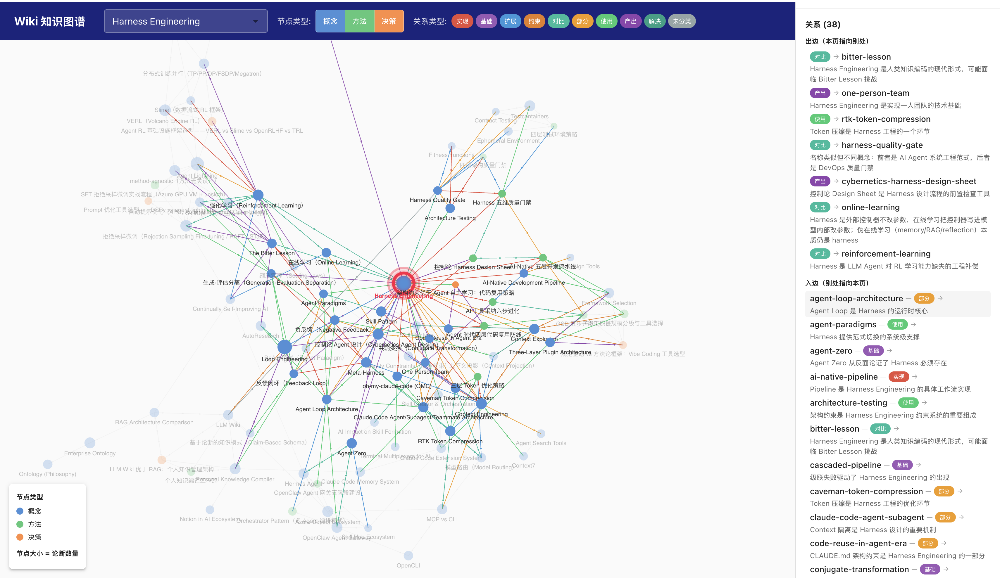

# Mindforge

> A personal knowledge forge — notes on AI engineering, cloud architecture, philosophy of technology, and the craft of building with modern tools.

This vault captures reading notes, technical deep-dives, and reflections from an architect's perspective. Topics span AI-native development workflows, context engineering, ontology-driven data platforms, and DevOps practices.

## Wiki Knowledge Graph



**[View Live Graph](https://huqianghui.github.io/mindforge/wiki/)** — Interactive force-directed visualization of the personal knowledge wiki, covering concepts, methods, decisions, and their typed relations.

Click any node to inspect its claims, confidence scores, and connections. Filter by node type, relation type, or search by keyword.

---

## 使用手册 / How to Use

本仓库是一个 **Obsidian 个人知识库（Personal Knowledge Compiler）**，由三层构成：

- **文章与笔记**（`Notes/` `Azure/` `paper/` `book/` `product/`）—— 长文与阅读笔记
- **日记**（`daily-work-item/`）—— 每日工作流水
- **LLM Wiki**（`wiki/`）—— 从日记与文章中编译出的结构化知识：概念 / 方法 / 决策 + 带证据和置信度的 Claims

### 概览统计

<!-- STATS:START (auto-generated by wiki/scripts/export-graph.py — do not edit by hand) -->
| 维度 | 数量 |
|------|------|
| 文章与笔记 | 113（Notes 92 / paper 10 / book 4 / product 4 / Azure 3） |
| 日记 | 88 |
| Wiki 页面 | 79 concepts + 15 methods + 7 decisions |
| Claims（带证据的论断） | 402 |
| 知识图谱 | 101 节点 / 334 关系 / 9 种关系类型 |

> 统计由 `wiki/scripts/export-graph.py` 自动生成，更新于 2026-07-06。
<!-- STATS:END -->

### 1. 语义搜索（qmd）

本地混合搜索引擎（BM25 + 向量 + LLM 重排），已索引全部 `.md` 文件：

```bash
qmd query "如何做知识提取"              # 推荐：智能扩展 + 语义 + 重排
qmd search "RAFT" -c mindforge         # 纯关键词，找专有名词最快
qmd get qmd://mindforge/wiki/index.md  # 直接取文档
```

索引数据存于 `~/.cache/qmd/index.sqlite`（不进 git，源文件始终是本 vault）。改动内容后跑 `qmd embed` 刷新向量。

### 2. 浏览知识图谱

- **在线**：[View Live Graph](https://huqianghui.github.io/mindforge/wiki/) —— 力导向交互图，点节点看 Claims / 置信度 / 关联，支持类型筛选与关键词搜索
- **数据源**：`wiki/wiki-graph.json`（节点 + 关系 + 分类）；可视化前端在 `wiki/visualizer/`
- **重新生成**：`python3 wiki/scripts/export-graph.py`（扫描 concepts/methods/decisions 重建 JSON）

### 3. 阅读 Wiki

入口 `wiki/index.md`——含完整的概念 / 方法 / 决策索引。知识以 **Claim** 为单元：每条论断带证据来源、置信度（0.0~1.0）、生命周期状态（active / conflicting / outdated / stale）。9 种类型化关系（implements / grounds / extends / …）定义见 `wiki/_relations.md`。

### 4. 维护命令（Claude Code skills）

`/extract-knowledge` 提取知识 · `/evolve-wiki` 演进维护 · `/detect-conflict` 查冲突 · `/knowledge-gap` 找差距 · `/weekly-review` 周报。完整工作流见 `wiki/index.md`。

---

## Articles

### Notes/AI

- [与AI相处之道——从工具依赖到认知伙伴](Notes/AI/与AI相处之道——从工具依赖到认知伙伴.md)
- [构建AI Native CSU Team——从One Person Team到组织进化的实践思考](Notes/AI/构建AI%20Native%20CSU%20Team——从One%20Person%20Team到组织进化的实践思考.md)
- [FDE 职业进化论——AI 时代前线部署工程师的个人突围与团队重构](Notes/AI/FDE职业进化论——AI时代前线部署工程师的个人突围与团队重构.md)
- [Agentic Engineering——质量与成本的一体化优化](Notes/AI/Agentic-Engineering——质量与成本的一体化优化.md)
- [去除AI味：从语言指纹到人机文本边界的消融](去除AI味：从语言指纹到人机文本边界的消融.md)
- [Scaling Agentic AI with NVIDIA Dynamo on Azure AI Platforms](Notes/AI/Scaling-Agentic-AI-with-NVIDIA-Dynamo-on-Azure.md)

### Notes/AI/Context-Engineering

- [Context Engineering vs MCP — Full Series](Notes/AI/Context-Engineering/Context%20Engineering%20vs%20MCP/Context%20Engineering%20vs%20MCP%20-%20MOC.md)
- [A Survey of Context Engineering for Large Language Models 读书笔记](Notes/AI/Context-Engineering/A%20Survey%20of%20Context%20Engineering%20for%20Large%20Language%20Models/A%20Survey%20of%20Context%20Engineering%20for%20LargeLanguage%20Models%20读书笔记.md)
- [Context Engineering vs. Model Context Protocol](Notes/AI/Context-Engineering/A%20Survey%20of%20Context%20Engineering%20for%20Large%20Language%20Models/Context%20Engineering%20vs.%20Model%20Context%20Protocol.md)
- [MCP vs CLI — 为什么开发者在重新审视 MCP](Notes/AI/Context-Engineering/MCP%20vs%20CLI%20—%20为什么开发者在重新审视%20MCP.md)
- [Context7：让 AI Agent 实时获取最新文档的 MCP Server——以 Azure 文档为例](Notes/AI/Context-Engineering/Context7：让%20AI%20Agent%20实时获取最新文档的%20MCP%20Server——以%20Azure%20文档为例.md)

### Notes/AI/Claude-Code

- [Claude Code 系列 01：核心概念与设计哲学解析——从 Agent Loop 到 Harness 工程的实践地图](Notes/AI/Claude-Code/Claude%20Code系列01：核心概念与设计哲学解析.md)
- [Claude Code 系列 02：learn-claude-code——打开 Coding Agent 黑盒](Notes/AI/Claude-Code/Claude%20Code系列02：learn-claude-code——打开Coding%20Agent黑盒.md)
- [Claude Code 系列 03：Agent、Subagent 与 Teammate 架构解析——从一次性委派到长期协作](Notes/AI/Claude-Code/Claude%20Code系列03：Agent、Subagent与Teammate架构解析——从一次性委派到长期协作.md)
- [Claude Code 系列 04：扩展三剑客——Command、Skill 与 Agent 的区别与协作](Notes/AI/Claude-Code/Claude%20Code系列04：扩展三剑客——Command、Skill与Agent的区别与协作.md)
- [Claude Code 系列 05：记忆全景——从 Session 到 Memory 的六层持久化体系](Notes/AI/Claude-Code/Claude%20Code系列05：记忆全景——从Session到Memory的六层持久化体系.md)
- [Claude Code 系列 06：Plugin 生态调研——协议、最佳实践与自定义 Plugin 开发](Notes/AI/Claude-Code/Claude%20Code系列06：Plugin生态调研——协议、最佳实践与自定义plugin开发.md)
- [Claude Code 系列 07：Harness 分层架构——从 50 万行源码到社区框架的控制论解读](Notes/AI/Claude-Code/Claude%20Code系列07：Harness分层架构——从50万行源码到社区框架的控制论解读.md)
- [Harness 实践案例：从一次 Memory 失效到记忆治理体系](Notes/AI/Claude-Code/Harness实践案例：从一次Memory失效到记忆治理体系.md)

### Notes/AI/agent

- [OpenCLI——万物皆可 CLI 的结构化革命](Notes/AI/agent/OpenCLI——万物皆可CLI的结构化革命.md)
- [从 Google 五种 Skill Pattern 到 Agent Runtime——Skill、MCP 与 Agent 的统一架构](Notes/AI/agent/从Google五种Skill%20Pattern到Agent%20Runtime——Skill、MCP与Agent的统一架构.md)
- [Exa、Tavily 与 Context7——AI Agent 搜索三剑客的定位与 MCP 配置实践](Notes/AI/agent/Exa、Tavily与Context7——AI%20Agent搜索三剑客的定位与MCP配置实践.md)
- [Agent-Reach 与 OpenCLI——命令编排型 Agent 框架的两条路线](Notes/AI/agent/Agent-Reach与OpenCLI——命令编排型Agent框架的两条路线.md)
- [Agent 经典范式与人类问题处理模式的映射](Notes/AI/agent/Agent经典范式与人类问题处理模式的映射.md)
- [AutoResearch 概念澄清——与 Ralph-Loop 和 AutoML 的本质区别](Notes/AI/agent/AutoResearch概念澄清——与Ralph-Loop和AutoML的本质区别.md)
- [OpenClaw 架构解读——从 claw0 教学仓库理解 AI Agent 网关的核心设计](Notes/AI/agent/OpenClaw架构解读——从claw0教学仓库理解AI%20Agent网关的核心设计.md)
- [Voice Live Agent 实现架构——从级联流水线到 Azure Voice Live API](Notes/AI/agent/Voice-Live-Agent实现架构——从级联流水线到Azure-Voice-Live-API.md)
- [InkOS 深度感想——AI 小说创作中的 Harness Engineering 范式](Notes/AI/agent/InkOS深度感想——AI小说创作中的Harness%20Engineering范式.md)
- [Hermes Agent vs OpenClaw 深度技术对比](Notes/AI/agent/hermes-agent-vs-openclaw.md)

### Notes/AI/agent-lightning

- [Agent Lightning 系列 01：用 APO 做 Prompt Tuning——Azure 实践与 beam search 算法解析](Notes/AI/agent-lightning/Agent%20Lightning系列01：用APO做Prompt%20Tuning——Azure实践与beam%20search算法解析.md)
- [Agent Lightning 系列 02：框架全景与脊柱拆解——9 大模块与 method-agnostic 设计](Notes/AI/agent-lightning/Agent%20Lightning系列02：框架全景与脊柱拆解——9大模块与method-agnostic设计.md)
- [Agent Lightning 系列 03：自定义算法与 Trainer 集成——5 个 store 动作、生产者/消费者与一键运行](Notes/AI/agent-lightning/Agent%20Lightning系列03：自定义算法与Trainer集成——5个store动作、生产者消费者与一键运行.md)
- [Agent Lightning 系列 04：APO 源码剖析——算法 = LLM 调用 + sorted、虚拟多 agent 真相与核心使用场景](Notes/AI/agent-lightning/Agent%20Lightning系列04：APO源码剖析——算法=LLM调用+sorted、虚拟多agent真相与核心使用场景.md)
- [Agent Lightning 系列 05：SFT 路线剖析——reward 不喂答案而造标签、拒绝采样微调与自蒸馏真相](Notes/AI/agent-lightning/Agent%20Lightning系列05：SFT路线剖析——reward不喂答案而造标签、拒绝采样微调与自蒸馏真相.md)
- [Agent Lightning 系列 06：SFT 实战篇——从 Azure GPU VM 到跑通 unsloth 拒绝采样微调](Notes/AI/agent-lightning/Agent%20Lightning系列06：SFT实战篇——从Azure%20GPU%20VM到跑通unsloth拒绝采样微调.md)
- [Agent Lightning 系列 07：强化学习与 VERL 入门——RL 基础、三大框架架构对比与 agent-lightning 的选型逻辑](Notes/AI/agent-lightning/Agent%20Lightning系列07：强化学习与VERL入门——RL基础、三大框架架构对比与agent-lightning的选型逻辑.md)
- [Agent Lightning 系列 08：RL 实战篇——example 选型、calc_x 跑通 VERL 训练与 tinker 等框架](Notes/AI/agent-lightning/Agent%20Lightning系列08：RL实战篇——example选型、calc_x跑通VERL训练与tinker等框架.md)
- [Slime vs VERL 深度架构对比——数据流哲学、组件选型与训练推理栈分层](Notes/AI/agent-lightning/Slime%20vs%20VERL%20深度架构对比——数据流哲学、组件选型与训练推理栈分层.md)
- [Prompt 优化工具选型——DSPy、TextGrad、AdalFlow 与 agent-lightning 的决策指南](Notes/AI/agent-lightning/Prompt优化工具选型——DSPy、TextGrad、AdalFlow与agent-lightning的决策指南.md)
- [Agent Lightning 算法深解：APO = 文本梯度 + Beam Search，以及与其他搜索策略的对比](Notes/AI/agent-lightning/Agent%20Lightning算法深解：APO=文本梯度+Beam%20Search，以及与其他搜索策略的对比.md)

### Notes/AI/SkillOpt

- [SkillOpt 实战篇：从 AML + Azure OpenAI 到 SearchQA 跑通文本空间 skill 训练](Notes/AI/SkillOpt/SkillOpt实战篇：从AML+Azure%20OpenAI到SearchQA跑通文本空间skill训练.md)
- [SkillOpt 源码篇：主要模块拆解与六阶段执行流剖析](Notes/AI/SkillOpt/SkillOpt源码篇：主要模块拆解与六阶段执行流剖析.md)

### Notes/AI/Loop-Engineering

- [Loop Engineering 概念澄清——内循环、外循环与 Harness Engineering 的边界](Notes/AI/Loop-Engineering/Loop%20Engineering概念澄清——内循环、外循环与Harness%20Engineering的边界.md)
- [Loop Engineering 实践——把个人知识库改造成一个外循环系统](Notes/AI/Loop-Engineering/Loop%20Engineering实践——把个人知识库改造成一个外循环系统.md)

### Notes/AI/vibe-coding

- [系列01：全面系统的了解 Harness Engineering 的来龙去脉](Notes/AI/vibe-coding/Vibe%20Coding系列01：全面系统的了解Harness%20Engineering的来龙去脉.md)
- [系列02：架构师视角的 AI Harness Engineering 最佳实践](Notes/AI/vibe-coding/Vibe%20Coding系列02：架构师视角的AI%20Harness%20Engineering最佳实践.md)
- [系列03：AI-Native 开发实践——从 Figma 设计到 Superpowers Brainstorm 再到 Spec-Delta 工作流](Notes/AI/vibe-coding/Vibe%20Coding系列03：AI-Native开发实践——从Figma设计到Superpowers%20Brainstorm再到Spec-Delta工作流.md)
- [系列04：流程框架选择指南——GSD、SpecKit、OpenSpec 与 Superpowers 的组合实践](Notes/AI/vibe-coding/Vibe%20Coding系列04：流程框架选择指南——GSD、SpecKit、OpenSpec与Superpowers的组合实践.md)
- [系列05：大项目落地困局——从 Context 爆炸到 Skill Runtime 的范式迁移](Notes/AI/vibe-coding/Vibe%20Coding系列05：大项目落地困局——从Context爆炸到Skill%20Runtime的范式迁移.md)
- [系列06：GSD 项目规模分级实践——从快速脚本到超大规模的 Context 策略演进](Notes/AI/vibe-coding/Vibe%20Coding系列06：GSD项目规模分级实践——从快速脚本到超大规模的Context策略演进.md)
- [系列07：Coding Agent 时代的代码复用——从架构约束到 Plugin 协作的实践指南](Notes/AI/vibe-coding/Vibe%20Coding系列07：Coding%20Agent时代的代码复用——从架构约束到Plugin协作的实践指南.md)
- [系列08：GSD + Superpowers + gstack 三层插件架构——从定位争议到组合实践](Notes/AI/vibe-coding/Vibe%20Coding系列08：GSD+Superpowers+gstack三层插件架构——从定位争议到组合实践.md)
- [Claude Code 双插件最佳搭配：superpowers 当大脑，gstack 当手脚](Notes/AI/vibe-coding/references/Claude%20Code双插件最佳搭配：superpowers当大脑，gstack当手脚.md)（外部参考）
- [深入对比 Gstack、Superpowers 和 Compound Engineering 三个最火的 AI Coding 工具](Notes/AI/vibe-coding/references/深入对比Gstack、Superpowers和Compound%20Engineering三个最火的AI%20Coding工具.md)（外部参考）
- [系列09：开源社区框架融合实践——从双插件搭配到多工具编排的案例与模式](Notes/AI/vibe-coding/Vibe%20Coding系列09：开源社区框架融合实践——从双插件搭配到多工具编排的案例与模式.md)
- [系列10：oh-my-claude-code——Vibe Coding 的未来终极形态吗？](Notes/AI/vibe-coding/Vibe%20Coding系列10：oh-my-claude-code——Vibe%20Coding的未来终极形态吗？.md)
- [系列11：架构测试全景——从 ArchUnit 到 AI 辅助架构 Review 的工具链实践](Notes/AI/vibe-coding/Vibe%20Coding系列11：架构测试全景——从ArchUnit到AI辅助架构Review的工具链实践.md)
- [系列12：测试环境即代码——从 Testcontainers 到 Ephemeral Environment 的 Harness 实践](Notes/AI/vibe-coding/Vibe%20Coding系列12：测试环境即代码——从Testcontainers到Ephemeral%20Environment的Harness实践.md)
- [系列13：控制论如何指导 Harness Engineering——用 Regulation 和 Requisite Variety 让 Vibe Coding 变得可控](Notes/AI/vibe-coding/Vibe%20Coding系列13：控制论如何指导Harness%20Engineering——用Regulation和Requisite%20Variety让Vibe%20Coding变得可控.md)

### Notes/AI/voice

- [Speech 技术全景——从音频处理基础到 Turn-Taking 的深层机制](Notes/AI/voice/Speech技术全景——从音频处理基础到Turn-Taking的深层机制.md)
- [Speech Out 深入——Grapheme、Phoneme、G2P、Lexicon 与 SSML 的工程解析](Notes/AI/voice/Speech-Out深入——Grapheme、Phoneme、G2P、Lexicon与SSML的工程解析.md)
- [WebSocket 与 WebRTC 深度对比——从 Azure Voice Live API 看实时通信协议选型](Notes/AI/voice/WebSocket与WebRTC深度对比——从Azure%20Voice%20Live%20API看实时通信协议选型.md)

### Notes/AI/RAG

- [qmd 与 Microsoft Foundry IQ 的 RAG 能力对比——从个人知识库到企业级检索](Notes/AI/RAG/qmd与Microsoft%20Foundry%20IQ的RAG能力对比——从个人知识库到企业级检索.md)

### Notes/AI/inference

- [线性注意力时代的推理架构 · 之一——Transformer / Mamba / GDN 与 Hybrid 架构](Notes/AI/inference/线性注意力时代的推理架构之一——Transformer-Mamba-GDN与Hybrid架构.md)
- [线性注意力时代的推理架构 · 之二——为什么 Hybrid 模型难做 Prefix Caching](Notes/AI/inference/线性注意力时代的推理架构之二——为什么Hybrid模型难做PrefixCaching.md)
- [线性注意力时代的推理架构 · 之三——vLLM 与 SGLang 支持对比与调优](线性注意力时代的推理架构之三——vLLM与SGLang支持对比与调优.md)
- [SGLang 与 vLLM 的基因之争——为什么 Prefix Sharing × Hybrid 这条线 SGLang 领先](Notes/AI/inference/SGLang与vLLM的基因之争——为什么PrefixSharing×Hybrid这条线SGLang领先.md)

### Notes/AI/Design-Tools

- [Pencil 设计工具与 Claude Code 快速上手指南](Notes/AI/Design-Tools/Pencil设计工具与Claude%20Code快速上手指南.md)
- [在 Obsidian 中用 Excalidraw 与 Draw.io 绘制 Azure 架构图实战指南](Notes/AI/Design-Tools/在Obsidian中用Excalidraw与Draw.io绘制Azure架构图实战指南.md)

### Notes/DevOps

- [tmux 与 Claude 远程交互实践](Notes/DevOps/tmux与Claude远程交互实践.md)

### Notes/tool

- [Notion 学习笔记——核心概念、AI Agent 能力与 Obsidian-Claude Code 协作架构](Notes/tool/Notion学习笔记——核心概念、AI%20Agent能力与Obsidian-Claude%20Code协作架构.md)
- [cmux 使用笔记——从 Ghostty 增强到 AI Agent 终端的实践](Notes/tool/cmux使用笔记——从Ghostty增强到AI%20Agent终端的实践.md)
- [使用 Skill-Creator 融合多个 PPT Skill 打造 CSA 专属演示工具](Notes/tool/使用Skill-Creator融合多个PPT%20Skill打造CSA专属演示工具.md)
- [RTK 系列 01：RTK（Rust Token Killer）——AI Coding Agent 的 Token 压缩利器](Notes/tool/rtk/RTK系列01：RTK（Rust%20Token%20Killer）——AI%20Coding%20Agent的Token压缩利器.md)
- [RTK 系列 02：源码深度解析——从 CLI 代理到 Token 压缩的工程实现](Notes/tool/rtk/RTK系列02：源码深度解析——从CLI代理到Token压缩的工程实现.md)
- [RTK 系列 03：个性化优化引擎——基于 Session 数据的智能调优](Notes/tool/rtk/RTK系列03：个性化优化引擎——基于Session数据的智能调优.md)
- [Rust 开发环境与 Cargo 构建指南](Notes/tool/rtk/Rust开发环境与Cargo构建指南.md)
- [Caveman 深度解析——LLM Token 压缩的 Prompt Engineering 之道](Notes/tool/Caveman深度解析——LLM%20Token压缩的Prompt%20Engineering之道.md)
- [Caveman 与 RTK 对比——两种互补的 LLM Token 优化方案](Notes/tool/Caveman与RTK对比——两种互补的LLM%20Token优化方案.md)
- [CodexSaver 深度解析——基于 MCP 的模型路由 Token 成本优化](Notes/tool/CodexSaver深度解析——基于MCP的模型路由Token成本优化.md)
- [Typeless 深度解析——AI 语音输入如何超越传统 Speech-to-Text](Notes/tool/Typeless深度解析——AI语音输入如何超越传统Speech-to-Text.md)
- [Dev Tunnels 实践——本地服务暴露公网调试 Azure AI Search Skillset](Notes/tool/Dev%20Tunnels实践——本地服务暴露公网调试Azure%20AI%20Search%20Skillset.md)

### Notes/pkc

- [PKC 系列 01：从日记到知识库——Obsidian × oh-my-claudecode × LLM Wiki 的个人知识编译实践](Notes/pkc/PKC系列01：从日记到知识库——Obsidian%20×%20oh-my-claudecode%20×%20LLM%20Wiki%20的个人知识编译实践.md)
- [PKC 系列 02：个人知识编译器进化——从三层知识模型到持续迭代的知识系统](Notes/pkc/PKC系列02：个人知识编译器进化——从三层知识模型到持续迭代的知识系统.md)

### Azure

- [Microsoft Fabric IQ 与本体论（Ontology）研究](Azure/Microsoft%20Fabric%20IQ与本体论（Ontology）研究.md)
- [Azure Copilot 生态全景：Skills、MCP Server 与 Copilot Agents 的协作实践](Azure/Azure%20Copilot%20生态全景：Skills、MCP%20Server%20与%20Copilot%20Agents%20的协作实践.md)
- [Microsoft Fabric IQ 本体（Ontology）管理功能实操解析](Azure/Microsoft%20Fabric%20IQ本体（Ontology）管理功能实操解析.md)

### book

- [本体论（Ontology）：从哲学根基到计算机科学的概念迁移](book/本体论（Ontology）：从哲学根基到计算机科学的概念迁移.md)
- [西方本体论的当代转折](book/西方本体论的当代转折.md)
- [控制论相关概念澄清——Cybernetics、Harness、强化学习与在线学习](book/控制论相关概念澄清——Cybernetics、Harness、强化学习与在线学习.md)
- [控制论与科学方法论——从控制论到 AI Agent 设计方法论](book/控制论与科学方法论——从控制论到AI%20Agent设计方法论.md)

### product

- [Palantir Ontology：从哲学本体论到企业操作系统的工程实践](product/Palantir%20Ontology：从哲学本体论到企业操作系统的工程实践.md)
- [Palantir 数据本体论（Ontology）：从概念到产品的深度解析](product/Palantir数据本体论（Ontology）：从概念到产品的深度解析.md)
- [Accio Work——阿里跨境 AI Agent 工作台与企业级 Skill Hub 设计解读](product/Accio%20Work——阿里跨境AI%20Agent工作台与企业级Skill%20Hub设计解读.md)
- [摄像头 ReID 人物识别——证明系统随使用越来越准的评估基准与流程设计](product/摄像头ReID人物识别——证明系统随使用越来越准的评估基准与流程设计.md)

### paper

- [How AI Impacts Skill Formation — 读书笔记与质疑](paper/2026-03-18-How-AI-Impacts-Skill-Formation.md)
- [The Bitter Lesson — 算力终将胜出，对 AI Agent 工程的启示](paper/2026-03-21-The-Bitter-Lesson.md)
- [Continually Self-Improving AI 论文精读笔记](paper/2026-03-22-Continually-Self-Improving-AI论文精读笔记.md)
- [Building Enterprise Realtime Voice Agents 论文精读笔记](paper/2026-04-06-Building-Enterprise-Realtime-Voice-Agents.md)
- [Meta-Harness 论文解读与实践思考——概念澄清、三种构建路径对比与工程落地](paper/2026-04-16-Meta-Harness论文解读与实践思考.md)
- [VAD 技术全景——从噪声环境论文到工业级语义端点检测](paper/2026-04-27-VAD-in-Noisy-Environments.md)
- [Brevity Constraints Reverse Performance Hierarchies in Language Models——简洁约束逆转模型性能层级](paper/2026-04-29-Brevity-Constraints-Reverse-Performance-Hierarchies.md)
- [AgenticRAG — Agentic Retrieval for Enterprise Knowledge Bases 论文精读笔记](paper/2026-05-28-AgenticRAG-Agentic-Retrieval-for-Enterprise-Knowledge-Bases.md)
- [RAFT（Reward rAnked FineTuning）论文解读——拒绝采样 SFT 的理论出处，与 STaR、agent-lightning 的关联](paper/2026-06-28-RAFT-Reward-rAnked-FineTuning-论文解读.md)
- [SkillOpt 论文解读——把 agent skill 当作 frozen agent 的可训练外部状态，与 agent-lightning APO 的本质区别](paper/2026-07-01-SkillOpt.md)

---

## License

Personal knowledge notes. Feel free to reference with attribution.
