# Dream-RSI 论文初读——探索历史即 replay simulator：三阶段 RSI 循环、与 SkillOpt 的同构分工及三层学习位置

> 论文：[Dream-RSI: Recursive Self-Improvement through Evolving Worlds（arXiv 2609.14858）](https://arxiv.org/abs/2609.14858)，Google / Google DeepMind / UMD / UVA，2026-09-14。
> 本篇是初读笔记，源自一次初步技术讨论——起点是"它到底优化了什么"和"与 SkillOpt 的关系"两个问题，延伸出三处概念定位：它在 RL 里的准确坐标（off-policy evaluation）、它那层代码为什么不在现有 coding agent 的 harness 里、以及学习与搜索两个维度各自的三层位置（含思维链算不算搜索）。replay objective 设计、防作弊机制、实验数字等细节留待精读补充（见文末待深入清单）。

第一眼看 Dream-RSI 的循环——记录 bad case、探索、修改、打分、保留更好的版本——会觉得和 [SkillOpt](2026-07-01-SkillOpt.md) 差不多。这个直觉抓对了骨架：两者都是**自我改进 Agent（self-improving agent）**家族的成员，都在模型权重之外做优化。但两者优化的"东西"不同、验证的方式更不同，而后一个差别才是这篇论文真正的贡献。

## 一、它在解决什么问题：探索太贵

Dream-RSI 面向的是**搜索型任务**：算法工程、数学优化、GPU kernel 优化。这类任务的特点是没人知道正确答案，agent 只能"提案 → 编译 → benchmark → 看结果 → 再提案"，一轮发现可能要几千次真实执行，每次都烧编译和 GPU 时间。**瓶颈不在 LLM 会不会写代码，而在有限的计算预算该花在搜索空间的哪里**——先深挖当前分支还是广撒网、何时剪枝、并行开几路。控制这些决策的东西叫 **exploration policy（探索策略）**。

问题在于：想改进 exploration policy，按常规每个候选策略都得重新跑一轮几千次的真实探索才能打分——改进策略的成本比执行任务本身还贵。这正是它与 RL 后训练困境同款的"rollout 太贵"问题（[agent-lightning 系列](../Notes/AI/agent-lightning/)的老熟人），只是发生在 agent 之外的编排层而不是权重层。

## 二、核心洞察：已完成的探索历史，本身就是一个仿真器



Dream-RSI 的回答分三阶段循环：

1. **Online Explore**：当前策略 πₙ 指挥 coding agent 真实探索，展开一棵 **discovery tree**——每个分支节点记录"试了什么方案、执行结果是什么、得了多少分"；
2. **Construct Replay Simulator**：把这棵树整理成可复用的**回放仿真器**——树上每条路径的后果都已经真实发生过，"如果走这个分支会怎样"变成了查表；
3. **Dreaming-based Policy Improvement**：一个独立的 **Policy Developer Agent** 读历史和诊断反馈，批量改写出成百上千个候选策略 π′₁…π′ₖ，全部放进 replay simulator 离线打分——不同策略在同一棵树上会走出不同轨迹（选不同分支、不同顺序、不同并行度、更早停止），评估只需翻出已存储的结果，**一行代码都不用重跑**。胜出者部署为 πₙ₊₁，开始下一轮真实探索，树变大、仿真器池扩张，循环递归。

一句话：**一次昂贵的真实探索，摊销给成百上千个候选策略的离线评估。**

### 与世界模型的关系：借了 dreaming 的名字，但沙箱不是学出来的

论文自己把这套做法类比到 model-based RL 和 World Models——"dreaming"一词直接来自 Dreamer（[世界模型系列03](../Notes/Embodied%20AI/世界模型系列03：世界模型与强化学习的边界——判别三要素、脑内模拟器与特斯拉FSD的归类.md)交叉深度二："在想象里训练"）。但有一个本质区别值得钉死：

| | Dreamer / V-JEPA 2 | Dream-RSI |
| --- | --- | --- |
| 沙箱是什么 | **学出来的**动力学模型（RSSM / latent predictor） | **精确回放**已实现的搜索历史 |
| 能评估的范围 | 可以泛化到没见过的状态-动作（有模型偏差风险） | 只限历史树已覆盖的分支（零偏差，但 off-policy 受限） |
| 训练成本 | 要专门训练世界模型 | 免费——历史本来就要记录 |

所以 Dream-RSI 是一种 **world-model-free 的 dreaming**：不学 P(s′|s,a)，直接把"已经发生过的世界"当沙箱。代价是候选策略若想走进历史树没覆盖的区域，replay 给不出答案——这既是它便宜的原因，也是它的天花板（防作弊机制如何处理这条边界，待精读）。对照[世界模型系列01](../Notes/Embodied%20AI/世界模型系列01：世界模型不是一种架构——像素、潜空间、显式3D与物理方程四条实现路线.md)"在脑子里演一遍"的框架：四条路线之外，这算第五种最朴素的沙箱——**录像回放**。

### 更贴的 RL 坐标：off-policy evaluation，而不是 model-based dreaming

论文用 Dreamer 做类比容易让人找错参照系。在 RL 词汇里，"用一批已记录的轨迹去评估另一个没跑过的策略"有一个精确的名字：**off-policy evaluation（OPE）**，属于 **offline RL** 而不是 model-based RL——后者要学一个函数近似的动力学模型，前者直接用日志。

顺带把三个容易混的"搜索空间"分清，因为 exploration policy 一词在每个空间里含义都不同：

| 搜索空间 | 在找什么 | 代表方法 | exploration 指什么 |
| --- | --- | --- | --- |
| **状态/动作序列空间** | 从当前状态到目标的路径 | MCTS、A*、MuZero 树搜索 | 树里先展开哪个节点（UCT） |
| **策略参数空间** | 使 J(θ) 最大的 θ | 策略梯度（局部搜索）、ES/CMA-ES | 参数扰动的方向与幅度 |
| **经验/数据空间** | 能带来信息的交互数据 | ε-greedy、UCB、intrinsic motivation | 要不要试没试过的动作 |

RL 教科书里的 exploration-exploitation 说的是第三个；**Dream-RSI 的 exploration policy 属于第一个**——它是搜索控制策略（search control policy）。而"优化这个策略"本身又可以形式化成一个 meta-MDP（state = 当前 discovery tree，action = 扩哪个分支/分配多少预算，reward = 最终发现质量），落进 **learning to search / metareasoning** 这条传统。

顺着 OPE 这条线还能看清它与经典做法的差别——它其实是 OPE 的一个**退化且更干净的特例**：

| | 经典 OPE | Dream-RSI 的 replay |
| --- | --- | --- |
| 转移 | 随机 → 必须用 importance sampling 权重修正 | **确定且已记录** → 不需要 IS，没有方差爆炸问题 |
| 估计性质 | 统计估计量（IS / WIS / DR / FQE），有偏差-方差权衡 | **查表精确回放**，零估计误差 |
| 唯一约束 | coverage + 方差 | **只剩 coverage**：这条分支日志里有没有 |

它把 OPE 最难的那一半（随机性修正）用"代码执行本身是确定性的"消掉了，只留组合覆盖一个约束。**这个重命名直接解释了两个待精读问题的本质**：

- **off-policy 边界** = OPE 的 **coverage / support** 问题——候选策略选了历史树没覆盖的分支，日志里没有对应结果，估计量根本无定义（对应 offline RL 的 OOD action 问题，CQL/IQL 那一族用悲观主义处理）；
- **policy cheating** = OPE 被 gaming——候选策略可能利用"答案已经躺在日志里"这一事实（例如直接跳到已知最高分的叶子），而不是真的做出了好的探索决策。

还有一层呼应值得记下：**"采样太贵所以要离线复用已有轨迹"这个母题，在权重层和搜索策略层是同一件事。** PPO 的 `ratio = π_θ/π_old` 加 clipping 就是 off-policy 修正（一个 batch 跑多个 epoch，第二个 epoch 起数据已经过期，clip 在限制 IS 比率的有效范围），GRPO 的组内样本复用同理，[agent-lightning / verl](../Notes/AI/agent-lightning/) 存在的动机与 Dream-RSI 一字不差。区别只在优化对象：一个是权重，一个是搜索策略代码。

## 三、它到底优化了什么：agent 之外编排层的一段调度代码

最容易误会的三点，前两点论文给了明确答案，第三点需要对照现有 coding agent 的源码才能说清。

**其一，这不是模型后训练。** Coding agent、LLM 权重、评估器、执行接口全程不变（论文原话：underlying coding agent remains unchanged）。变的只有一个东西：**exploration policy 的可执行代码**——决定"从哪个分支继续、并行开几路、何时剪枝、预算怎么分"的那段调度逻辑，形态大致是：

```python
def exploration_policy(history):
    branches = select_branches(history)      # 选哪些分支值得继续
    parallelism = decide_parallelism(history) # 并行开几路
    while budget_remaining():
        branch = choose_next(branches)
        prune(branch) if should_stop(branch) else expand(branch)
```

**其二，exploration policy 不是模型的某一层。** 它可以是一段代码（本文情形）、一个 prompt、一个小模型，甚至一组可训练参数，但都在 LLM 之外。系统里实际有两个 agent 分工：**Discovery Agent**（干活的，不变）和 **Policy Developer Agent**（改策略代码的，也是 LLM-based）——后者改前者的"指挥方式"，而不是改前者本身。

### 其三：这层代码不在现有 coding agent 的 harness 里

读过 Claude Code / OpenCode 源码会产生一个合理疑问：harness 里就是一个 loop（判断是否结束 + 调工具）加 session 管理、context 压缩、记忆、日志、checkpoint、权限、沙箱——**没有任何搜索代码，exploration policy 在哪？**

答案是：**确实不在，这层是 Dream-RSI 在 coding agent 外面新加的。** 交互式 coding agent 的 harness 是**单轨执行器**——一条轨迹走到底，没有并行候选、没有分支比较、没有预算分配。"探索"决策（这个方法失败了要不要换思路）并非不存在，而是**隐式地混在 LLM 的下一步决定里**，harness 不管这件事。Plan mode 也不是搜索：它只是权限门（先只读调研、批准后执行），约束的是"什么时候可以写"，不是"预算花在哪个分支"，执行阶段仍是单轨。

Dream-RSI 面向的 open-ended discovery 任务天生需要同时开几十上百个 workspace 试不同方向，所以系统结构是**两层**：

```text
┌─────────────────────────────────────┐
│  编排层（Dream-RSI 新加的那层）        │
│  exploration policy：开几路并行、     │
│  哪个分支继续挖、何时剪枝、预算分配     │
└──────┬──────────┬──────────┬────────┘
       ▼          ▼          ▼
  workspace₁  workspace₂  workspace₃
  ┌────────┐  ┌────────┐  ┌────────┐
  │ coding │  │ coding │  │ coding │   ← 每个都是一个
  │ agent  │  │ agent  │  │ agent  │     "Claude Code 式"单轨 loop
  └────────┘  └────────┘  └────────┘
```

论文说这层 orchestration layer 的作用是 "makes exploration **explicit and programmable**"——关键在 **explicit**：把普通 agent 里由模型隐式承担的探索决策抽出来，变成显式、可编程的代码，它才成为可优化的对象。这层结构在 AlphaEvolve、FunSearch、AIDE 这类搜索/进化式发现系统里是主体，在交互式 coding 助手里则根本不需要。要在日常工具栈里找对应物，最接近的是**单轨 loop 之上的编排**：多 agent fan-out + pick-the-winner 的分发脚本（开几路、怎么选 winner、要不要再迭代的那段逻辑），以及退化形态的串行重试循环——Dream-RSI 做的事，相当于让这段编排逻辑自己进化，并用历史运行记录离线评估进化出的版本。

## 四、与 SkillOpt 的同构与分工

骨架同构、对象不同，一张表说清：

| | [SkillOpt](2026-07-01-SkillOpt.md) | Dream-RSI |
| --- | --- | --- |
| 优化对象 | Skill / instruction（`skill.md` 文本） | exploration policy（可执行调度代码） |
| 优化的知识类型 | **procedural knowledge**——"遇到这种任务该怎么做" | **search behavior**——"预算该花在搜索空间哪里" |
| 失败的定义 | 任务做错、工具用错、流程不对 | 探索方向没找到更好的解 |
| 验证方式 | held-out validation，**核心评估仍需真实 rollout** | **历史树上离线 replay**，免真实执行 |
| 防错机制 | validation gate、rejected-edit buffer、text learning rate | replay objective 设计、防策略作弊（待精读） |
| 模型权重 | 不变 | 不变 |

两者其实对应经典 RL 里 **exploitation 与 exploration** 的分工：SkillOpt 让 agent 把已知的做法执行得更好，Dream-RSI 让 agent 更聪明地决定去尝试什么。这直接给 [SkillOpt系列04](../Notes/AI/SkillOpt/SkillOpt系列04：APO×SkillOpt联合展望——先探索后精修的两段式管道与选型算账方法.md) 的组合思路加了第三块拼图：一个 coding agent 可以同时挂 SkillOpt（优化执行技能）和 Dream-RSI 式的策略层（优化搜索调度），两者互不冲突——一个改 `SKILL.md`，一个改 `policy.py`。

Dream-RSI 对 SkillOpt 最有价值的启发是**评估成本**：SkillOpt 的每个候选 skill 都要真实 rollout 验证，而 SkillOpt 的历史 trajectory 里同样躺着大量"当时如果用别的 skill 会怎样"的部分信息——哪些环节可以借 replay 思路降低验证成本，值得在 SkillOpt 实践里回头想。

## 五、两个维度的定位：学习在哪一层、搜索在哪一层

### 5.1 三层学习位置：权重、技能、搜索策略

把最近讨论过的自我改进方法放进一张定位图，这可能是本次讨论最值得留下的心智模型：

| 学习位置 | 方法 | 修改什么 | 需要什么反馈 |
| --- | --- | --- | --- |
| **Model 层** | Fine-tuning / RL（GRPO、[agent-lightning](../Notes/AI/agent-lightning/)） | 神经网络权重 | 大量 rollout + reward |
| **Skill 层** | [SkillOpt](2026-07-01-SkillOpt.md) / APO | 技能文档、指令文本 | 真实 rollout + validation |
| **Search 层** | **Dream-RSI** | exploration policy 代码 | 历史 replay（离线、免费） |

三层正交，回答三个不同的问题：参数怎么变、怎么执行、去哪里搜。Dream-RSI 的标志性结论是：**递归自我改进（RSI）不一定要动模型权重，甚至不用训练任何网络——只要 agent 能修改自己的探索策略代码，且能可靠地评价修改结果，RSI 循环就成立了**。"可靠评价"那一半由 replay simulator 提供，这与 SkillOpt 用 validation gate 换可靠性是同一个命题的两种解法：**自我改进的瓶颈从来不是"会不会改"，而是"改了之后敢不敢信"**。

### 5.2 三层搜索位置：思维链算不算搜索

与"学习在哪一层"对照的另一个维度是"**真正的搜索发生在哪一层**"。这条线索来自一个自然的追问：推理模型内部的思维链（CoT），本质上是不是一种搜索和尝试？

答案是**现象上是，机制上不是**。CoT 的计算过程是逐 token 自回归采样、KV cache 只能追加，所以它与真搜索的差别很具体：

| | 真搜索（MCTS / A*） | CoT |
| --- | --- | --- |
| 状态 | 显式数据结构，可保存/恢复 | 隐式在 context 里 |
| 回溯 | **硬回溯**：真回到父节点，子树丢弃 | **软回溯**：只能写"刚才错了，换个思路"——错误 token 仍留在 context 里继续作为条件 |
| 分支 | 可并行、可枚举、可比较 | 串行单轨，同一时刻只有一条路径 |
| 剪枝 | 显式判据 | 隐式，模型自己判断 |
| 中间验证 | 每个节点可独立评估 | 中间的"验证"本身也是生成的文本，可能是幻觉 |

"软回溯"是最要害的一条：MCTS 丢弃子树是结构性删除，CoT 只能靠注意力压低废弃分支的权重——压不干净就表现为模型陷在错误框架里出不来。而它"像搜索"的那部分，实质是 RL 训练出的模型**把一棵搜索树压平成了线性 token 流**，搜索状态存在 context window 而非外部结构里（这也是推理模型烧 token 的原因）。顺带一个机制点：单次前向传播深度固定、计算量有上限，**CoT 的本质作用是把网络深度换成序列长度**，这既是它有效的原因，也是它无法在一次前向里做无界搜索的原因。

所以准确的说法是**摊销搜索（amortized search）**：真搜索发生在 RL 训练阶段（RLVR/GRPO 在大量 rollout 里探索哪些推理路径有效），推理时那一条 CoT 是摊销后的策略执行。最好的类比是 AlphaZero——训练时用 MCTS 搜索并把访问分布蒸馏进策略网络，之后策略网络单独一次前向就能下出不错的棋，那一次前向不是搜索，是搜索的摊销产物。

于是搜索也落在三个位置：

| 位置 | 是不是真搜索 | 形态 |
| --- | --- | --- |
| **训练时** | ✅ 是 | RL 在推理空间跑大量 rollout，探索哪些路径有效 → 摊销进权重 |
| **推理时（单条 CoT）** | ❌ 不是 | 摊销后的策略执行；像搜索是因为它在模仿搜索轨迹 |
| **推理时外层** | ✅ 是 | 把显式搜索加回来：best-of-N、self-consistency、Tree-of-Thought、对推理步做 MCTS，以及 **Dream-RSI 式的多 workspace 编排** |

```text
训练时搜索（RL）     → 摊销进权重
      ↓
推理时单轨 CoT       → 一次 rollout，软回溯，无树
      ↓
外层显式搜索/编排     → 真分支、真剪枝、真预算分配
                       （best-of-N → ToT → Dream-RSI 的 exploration policy）
```

**Dream-RSI 的位置由此彻底清楚**：它不动第一层（不训模型）、不改第二层（coding agent 不变），只优化第三层的调度代码；而它优化第三层的方式又回到第一层的思路（用历史数据离线评估候选策略），只是评估对象从权重换成了代码。这也再次印证第三节那个结论——**要获得真正的搜索性质（可比较的分支、可丢弃的错误路径、可分配的预算），必须在模型之外加一层编排**，所以那层代码不可能在 Claude Code 的单轨 loop 里找到。

把两个维度合起来看：**学习可以发生在权重/技能/搜索策略三层，搜索可以发生在训练/单轨推理/外层编排三层**——Dream-RSI 的独特位置是"在搜索的第三层上做学习的第三层"。

## 六、待深入（精读清单）

- **Replay objective 怎么设计**：离线分数与真实部署表现之间的 gap 如何控制（OPE 语境下即估计量与真实 J(π) 的偏差）；
- **防策略作弊（policy cheating）**：概念归属已清楚（= OPE 被 gaming，见第二节），待看论文用的具体手段——惩罚项？信息屏蔽？还是限制 policy 可见的树信息；
- **off-policy 边界**：概念归属已清楚（= coverage / support 问题），待看论文对走出覆盖范围的分支怎么处理——截断、悲观惩罚（CQL/IQL 那一族的思路）、还是部分模拟；
- **实验数字**：算法工程 / 数学优化 / GPU kernel 三个领域的具体提升幅度与成本节省比例；
- **与 SkillOpt 结合的架构**：同一个 agent 双层优化的干涉问题（skill 变了，旧 discovery tree 的 replay 是否失效——这个问题两篇论文都没回答）。

## 参考

- [Dream-RSI: Recursive Self-Improvement through Evolving Worlds（arXiv 2609.14858）](https://arxiv.org/abs/2609.14858)
- [SkillOpt 论文解读——把 agent skill 当作 frozen agent 的可训练外部状态](2026-07-01-SkillOpt.md)
- [Offline Reinforcement Learning: Tutorial, Review, and Perspectives on Open Problems（Levine et al., 2020）——offline RL 与 OPE 的综述](https://arxiv.org/abs/2005.01643)
- [世界模型系列03：世界模型与强化学习的边界——判别三要素、脑内模拟器与特斯拉FSD的归类](../Notes/Embodied%20AI/世界模型系列03：世界模型与强化学习的边界——判别三要素、脑内模拟器与特斯拉FSD的归类.md)
- 一次关于 Dream-RSI 与 SkillOpt 异同的初步技术讨论，经整理与论文核订成文
