# TypeSafe Jev：System One 模型、RLCD 与校准决策——从聊天模型到软件可直接消费的决策原语

> TypeSafe AI 于 2026 年 9 月 15 日发布第一款 System One Model，命名 Jev（取自经济学家 William Stanley Jevons，寓意智能变得足够便宜时需求反而上升）。公开报道称创始人 Diogo Almeida 曾在 OpenAI 参与 ChatGPT 与 RLHF 的早期工作。它的主张很直接：过去几年的模型都在优化"给人看的文字"，而软件里绝大多数决策要的是一个能直接执行的类型化答案。本文不评测产品，只把四个概念串起来：System One 是什么，RLCD 是什么，校准决策与传统分类分数差在哪，以及企业拿到一个 confidence 之后怎么让它变得可信。
>
> 素材来自 2026-09-26 的一场 ChatGPT 讨论（五轮问答），关键事实对照 TypeSafe 官网、[DataCamp 解读](https://www.datacamp.com/blog/system-one-models-jev) 与 [Turing Post 指南](https://www.turingpost.com/p/what-is-jev-rlcd) 核订。本文与 [FinOps 系列 02](../Notes/FinOps/FinOps系列02：数据飞轮与RSI——三层嵌套循环与一个贯穿指标.md) 第五节互为补充：那里讨论 RLHF 与 RLVR 对应 AI 好用与不好用的两栏，这里补上第三条路。
>
> 官网：[typesafe.ai](https://typesafe.ai)｜创始人演讲：[AI: too good to be true, too bad to be useful](https://typesafe.ai/blog/ai-too-good-to-be-true-too-bad-to-be-useful-typesafe-ai)

---

## 一、System One 是什么，与 reasoning 模型的分界在哪

### 1.1 名字的来源与真正的含义

System One 借自 Kahneman 的 System 1 与 System 2：前者快速、直觉式判断，后者慢速、审慎推理。TypeSafe 的判断是，现有 LLM 全部落在 System 2 一侧，长思维链、多秒级推理轨迹、面向人的文字输出，而软件里的大多数决策，比如这条消息是不是垃圾、下一步该调哪个工具、这个请求属于哪类，要的是一个快速的 System 1 答案。

容易误解的一点：System One 不是"不思考、智力低"。TypeSafe 明确希望它在特定决策任务上保持前沿水平的判断力，改变的是计算形式，从生成文字变成直接做决策。它也不是"一个更小的 LLM"，TypeSafe 声称使用了新的模型架构、并行采样器与新的训练方法，只是架构细节至今没有公开。

### 1.2 输出原语从 token 换成 typed decision

传统 LLM 的输出是 token 序列，每个 token 依赖前面的 token，解码天然串行：

```
P(y1 | x), P(y2 | x, y1), P(y3 | x, y1, y2), ...
```

即使套上 JSON Schema 或 Structured Output，改变的只是最终格式约束，没有改变模型的计算方式，模型仍然在逐 token 生成一段字符串，程序再去解析、校验、取值。

Jev 的做法是把问题本身换掉。调用方先声明问题与答案空间，目前支持三种原语：Choice（从固定选项中选）、Score（打分）、Noul（是或否）。模型对每个问题直接输出一个概率分布和一个 confidence，多个问题在同一次前向里并行给出：

```
State: "Tornado's a-comin"
Questions:
  sky_color  → Choice(blue, gray, green, orange, red, purple, black)
  weather    → Choice(tornado, hurricane, thunderstorm, normal)
  risk       → Choice(low, medium, high)

Output:
  sky_color: {gray 0.61, green 0.27, black 0.08, ...}   confidence 0.83
  weather:   {tornado 0.92, ...}                         confidence 0.95
  risk:      {high 0.88, ...}                            confidence 0.90
```

所以准确的说法不是"把 decoding 并行化"，而是模型的基本输出单位从 token 变成了 typed decision。由此带来的几个性质是构造上成立的，不是调出来的：不会输出 schema 之外的值，因此没有格式错误也没有"编造"的自由文本（TypeSafe 报告结构化输出错误率为零）；不生成任何解释、代码或理由；多加一个问题几乎不增加延迟，只多付问题本身的 token。

### 1.3 与 reasoning 模型的对照

| | Reasoning LLM（System 2） | System One Model（Jev） |
|---|---|---|
| 输出单位 | token 序列，可含思维链 | typed decision：分布 + confidence |
| 计算形式 | 自回归，测试时算力随推理长度增长 | 一次前向，并行给出多个决策 |
| 输出空间 | 开放，由模型生成 | 封闭，由调用方在运行时声明 |
| 解释性 | 有 rationale 可读 | 没有 rationale，只有概率 |
| 延迟 | 秒级到分钟级 | TypeSafe 报告 70~500ms 端到端 |
| 适用位置 | 开放式生成、复杂多步推理、需要向人解释 | 程序里的 if / switch / 路由 / 打分 / 门控 |
| 训练目标 | RLHF、RLVR | RLCD |
| 输入模态 | 多模态 | 目前为文本与结构化状态，官方 demo 注明尚不支持图像 |

两者的关系是组合而非替代。DataCamp 的概括很准确：让 Jev 做快速的分类、打分、路由层，把少量困难或开放式的 case 交给 reasoning 模型，而让这次交接干净的正是 confidence 阈值。这与 [Agent Harness](../wiki/concepts/harness-quality-gate.md) 里"生成与门控分离"的思路是同一件事：生成归 LLM，判断该不该执行归一个专门的决策层。

### 1.4 定价与宣称数字的位置

TypeSafe 公布的价格是输入每十亿 token 42 美元，输出不计费，并给出相对前沿模型数十到数百倍的速度与成本优势。这些数字来自其自建的 workflow benchmark，参考模型与场景由它自己选，TypeSafe 也承认无法证明当前定价没有补贴。可以把它们理解为方向性信号：当输出不再是长文本而是几个数，按 token 计费的经济学确实会变，但具体倍数要等独立测试与真实 workload。

## 二、RLCD 与 RLHF、RLVR 的区别

### 2.1 三种训练目标

RLCD 全称 Reinforcement Learning for Calibrated Decisions，TypeSafe 把它与两条已有路线并列：

| | RLHF | RLVR | RLCD |
|---|---|---|---|
| 问的问题 | 人更喜欢 A 还是 B | 程序能验证这个答案对不对 | 在这个决策上，概率分布应该是什么 |
| reward 来源 | 人类偏好，训练成 learned reward model | 程序化验证器 | 参考概率分布 |
| 优化出的性质 | 让人满意的回复，即辅助 | 得到可验证的正确答案 | 校准过的不确定性 |
| 适用任务 | 开放式生成 | 有 ground truth 可查的任务 | 能拆成 Choice / Score / Noul 的决策 |

讨论里提出的质疑是关键：自然语言没有标准答案，所以才不得不用人类偏好或价值函数来对齐；如果都不用，凭什么相信模型给出的 0.93 是对的？回答分两步。

第一步，任务先被限制成三种原语。一旦问题变成"从四个选项里选一个"或"是或否"，概率学习就有了定义，不再需要"人喜欢哪段文字"这种代理。

第二步，参考分布从哪来。TypeSafe 公开的做法是：假设 workflow（harness）本身是正确的，然后用最大最贵的外部前沿模型对同一问题给出的概率取平均作为 reference。目前公开提到的是 GPT-6 Astra 与 Claude Fable 5.1。RLCD 训练 Jev 让自己的分布逼近这个 reference：

```
Question: customer_intent ∈ {refund, cancellation, complaint, other}
Input:    "I don't want this subscription anymore."

Astra:  refund 0.10  cancellation 0.82  complaint 0.05  other 0.03
Fable:  refund 0.08  cancellation 0.87  complaint 0.03  other 0.02
reference（平均）: refund 0.09  cancellation 0.845  complaint 0.04  other 0.025

Jev 训练目标：逼近 reference，而不是输出 cancellation = 0.99
```

### 2.2 RLCD 学到的是什么，没学到的是什么

由此可以准确说出 RLCD 学到的东西：对于这类 workflow 决策，什么样的概率分布与高质量参考判断一致。它没有学到"宇宙真理"。前沿模型的共识不等于 ground truth，TypeSafe 自己也承认这会让 benchmark 偏向 OpenAI 与 Anthropic 的模型。所以要把两件事分开：

- RLCD 解决的是"模型的不确定性是否有意义"，即说 0.9 时是否真的大约九成对。
- RLCD 没有解决"这个决策本身是否正确"。参考分布错了，Jev 会校准地跟着错。

这与 RLHF 的区别在于问的问题不同：RLHF 问 A 和 B 哪个更好，不问 A 的概率是多少；RLCD 只问概率。与 RLVR 的区别在于信号来源：RLVR 要有可执行的验证器，RLCD 只要有可信的参考分布，覆盖面更宽但正确性保证更弱。

### 2.3 probability 与 confidence 是两个量

Jev 的 API 把两者分开，理解这点对后面的企业落地很重要：

- **probability** 回答"在这个答案空间里，各选项的相对可能性"。
- **confidence** 回答"我对这次判断整体有多确定"。

```
Case A: cancel 0.95, 其余 0.05            confidence 0.97   → 明确
Case B: cancel 0.55, refund 0.40, other 0.05   confidence 0.42   → 模型在说"我不太确定"
```

一个分布可以很尖但 confidence 很低，比如输入本身模糊或超出训练分布。Workflow 需要的正是第二个量：它让"AI 不知道自己不知道却继续执行"这个 agent 的老问题第一次有了可读的信号。

## 三、校准决策与传统机器学习分数的区别

### 3.1 输出头很像，差别在别处

从输出头的数学形式看，Jev 与一个 softmax 分类器几乎一样：输入进去，各类别的概率出来。讨论里这个类比是对的，真正的差别在四个地方。

| 维度 | 传统分类器 | Jev |
|---|---|---|
| 任务与标签 | 训练时固定（cat / dog、ImageNet 1000 类），换任务要重训 | schema 由程序在运行时声明，同一模型回答任意 Choice / Score / Noul |
| 输入 | 单一模态、单一对象 | 对话 + 客户档案 + 交易 + 账户状态 + 历史动作 + 业务规则的拼接状态，需要语言理解 |
| 输出结构 | 一个任务一个分布 | 多个问题一次并行给出，程序在代码里做分支 |
| 训练目标 | 交叉熵，准确率高时常伴随过度自信（准确率 90%，confidence 0.99） | 校准本身是训练目标，另有独立的 confidence 输出 |

传统机器学习并非不懂校准，temperature scaling、Platt scaling、isotonic regression 都是成熟的事后校准手段，但它们是针对一个固定任务、在一个固定数据集上做的后处理。Jev 的主张是把校准作为训练目标内建，并且跨任意运行时定义的任务成立。这个主张是否成立，正是企业落地时要自己验证的东西。

### 3.2 与"让 LLM 输出一个 confidence 字段"的区别

让 GPT 在 JSON 里加一个 `"confidence": 0.97` 很容易，但这个数没有训练目标约束它与正确率对应。LLM 报告的置信度普遍过度自信且不稳定，这是 TypeSafe 对现有模型的核心批评之一，也是讨论里"真正困难的不是让模型说出 0.93，而是让 0.93 具有概率意义"这句话的意思。

校准的定义可以画成一张可靠性表：把预测按 confidence 分桶，看每桶的实际正确率是否与桶中心一致。

| confidence 区间 | 样本数 | 实际正确率 | 判断 |
|---|---:|---:|---|
| 0.50~0.60 | 10,000 | 55% | 校准 |
| 0.70~0.80 | 25,000 | 74% | 校准 |
| 0.90~1.00 | 20,000 | 94% | 校准 |
| 0.90~1.00 | 20,000 | 71% | 严重过度自信，阈值 0.95 自动执行会大量出错 |

只有前三行那样的表成立，confidence 才有资格作为自动化阈值的信号。

## 四、企业落地：让 confidence 与 ground truth 一致

这一节是讨论里最有价值的部分。结论先说：不能因为模型是 RLCD 训练的就无条件相信 confidence，正确的路径是两层校准加一层业务策略，再用结果标签形成回流。



### 4.1 两层校准

**模型层校准**由供给方在训练阶段完成，就是 RLCD，解决"模型本身是否过度自信"。**应用层校准**由使用方在自己的 workflow 上完成，解决"这个模型在我的具体任务、具体客群上是否可靠"。绝不能从"Jev 说 0.97"直接跳到"生产是安全的"，中间必须经过应用层校准与验证过的阈值。

### 4.2 结果标签是前提

验证校准需要的不是"客户说了什么、Jev 判了什么"，而是最终结果：人工最终怎么处理、是否覆写了模型、业务结果如何。只有预测没有结果的历史数据只能观察模型行为，不能验证校准。所以进入工作流的第一步是把结果字段记全：

```
input · Jev prediction · confidence · calibrated probability · decision
· human override · final outcome
```

这七个字段与 [FinOps 系列 03](../Notes/FinOps/FinOps系列03：落地提纲——从使用洞见到优化、监控、评估闭环（活文档）.md) 提出的任务级度量字段是同一套东西的两面：那边算成本，这边算校准。

### 4.3 阈值来自业务数据，并且要带上错误成本

`if confidence >= 0.98: execute()` 里的 0.98 不能拍脑袋，要从可靠性表反推。而且阈值不该只看 confidence，还要看这个决策错了会怎样。同一个 0.99，自动推荐一条 FAQ 完全够用，自动删除生产数据库当然不行。所以策略函数至少有三个输入：校准后的概率、错误成本、人工复核成本。这正是 [FinOps 系列 01](../Notes/FinOps/FinOps系列01：从token价格到任务完成花费——指标转向与AI使用边界.md) 的迁栏阈值 (1 − 成功率) × 错误成本 < 人工复核成本 在单条决策上的形态：校准让"成功率"这一项对每条决策都可读，于是人工复核可以只落在被标记为低置信的那部分，而不是复核全部。

### 4.4 按任务校准与漂移

一个全局 confidence 往往跨任务不通用。同样是 0.95，意图识别可能 97% 对，欺诈判断 89%，法律风险只有 71%。所以校准函数应该是条件化的：

```
P(correct | task, confidence, customer_segment, state)
```

历史数据本身还有选择偏差、标签错误、分布漂移、季节与政策变化。2025 年客群上验证过的 0.95 不保证对 2026 年新客群成立。生产上需要持续的校准监测、漂移检测与定期重校准，这一层做到位，就已经接近一个 AI 控制平面。

### 4.5 验证、校准、后训练的顺序

有了历史数据能不能进一步后训练？理论上可以，但"验证"与"后训练"是两件事，顺序不能反：

| 层次 | 数据的作用 | 是否改模型 | 顺序 |
|---|---|---|---|
| Validation | 验证 confidence 是否与实际正确率匹配 | 否 | 先 |
| Calibration | 训练一个小校准模型，把 raw confidence 映射成真实业务概率，输入可含任务类型、客群、元数据 | 通常否 | 再 |
| Post-training | 让模型学习企业自己的决策模式 | 是 | 最后 |

后训练本身又分三种：领域适配的 SFT，学企业特有的规则（比如"客户说取消，但存在待处理提案且已退款，则不取消"）；RLCD 式的校准训练，把过度自信的 0.95 压到与结果一致的 0.75；以及策略学习。如果连"0.95 在我的业务里意味着什么"都没验证清楚就直接微调，反而会把问题藏起来。

更聪明的做法不是把全部历史数据塞进去训练，而是做错误与分歧挖掘：从历史记录里找 bad case（人工覆写、低置信却对、高置信却错），分别送去训练与校准，评估后影子部署，再从生产收新的 bad case。这与 [SkillOpt](../wiki/concepts/skillopt.md)、APO 的 bad-case mining 是同一个循环，只是优化对象从 agent 的 skill 文本换成了决策模型加 confidence 加 workflow 策略。放到 [FinOps 系列 02](../Notes/FinOps/FinOps系列02：数据飞轮与RSI——三层嵌套循环与一个贯穿指标.md) 的三层循环里，这就是中圈数据飞轮在决策模型上的具体形态。

### 4.6 数据授权边界

一个容易产生的假设需要纠正：TypeSafe 目前的公开条款写明默认不使用用户的 prompt 或输入训练模型，未经客户明确同意不会把客户数据放进修改权重的数据集。所以"把历史数据给它就自动变聪明"不成立；如果未来有 Bring Your Own Data 的定制训练，那会是一个需要明确授权的产品，而不是使用 Playground 的副作用。

反过来看，这里藏着一个判断：企业自己的"历史决策 + 最终结果"，在标签质量足够高、覆盖足够广时，可以构造出比"前沿模型共识"更好的 RLCD 训练信号，因为它是真实结果而不是另一个模型的意见。如果 System One 这类模型真正进入垂直场景，这可能是核心护城河之一，而它属于拥有结果标签的企业，不属于模型供给方。

## 五、判断与保留

- **值得关注的不是名字，是原语。** "System One Model"目前是 TypeSafe 自定义的类别，尚未成为社区共识；但"把不确定性变成软件可消费的一等公民"这个方向，对 agent 与 harness 的意义是实在的。传统 agent 最大的问题不是不知道答案，而是不知道自己不知道却继续执行，RLCD 瞄准的正是后半句。
- **RLCD 是第三条路，不是更强的 RLVR。** 它用参考分布换取了比 RLVR 更宽的覆盖面，代价是正确性保证更弱，参考偏差会被校准地继承。
- **校准是两层的，供给方只做了一层。** 模型层校准是产品卖点，应用层校准是使用方的责任，跳过它就是把 0.97 当作安全承诺。
- **保留项**：架构未公开、输入仅文本与结构化状态、benchmark 自报且参考模型偏向两家厂商、定价可能含补贴。这些都不妨碍理解概念，但妨碍现在就在高 stakes 的决策上依赖它。

---

**相关阅读**

- [FinOps 系列 01：从 token 价格到任务完成花费](../Notes/FinOps/FinOps系列01：从token价格到任务完成花费——指标转向与AI使用边界.md)：两变量分界与迁栏阈值，本文第四节阈值策略的来源
- [FinOps 系列 02：数据飞轮与 RSI](../Notes/FinOps/FinOps系列02：数据飞轮与RSI——三层嵌套循环与一个贯穿指标.md)：RLHF 与 RLVR 对应两栏、置信度校准降低验证成本
- [FinOps 系列 03：落地提纲](../Notes/FinOps/FinOps系列03：落地提纲——从使用洞见到优化、监控、评估闭环（活文档）.md)：任务级度量字段
- wiki：[Harness 质量门控](../wiki/concepts/harness-quality-gate.md)、[生成-评估分离](../wiki/concepts/generation-evaluation-separation.md)、[Reward 设计三份输入与两本账分家](../wiki/methods/reward-design-three-inputs.md)、[SkillOpt](../wiki/concepts/skillopt.md)、[LLM-as-a-Judge](../wiki/concepts/llm-as-a-judge.md)
